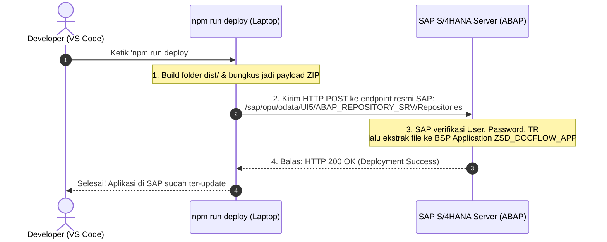

# Panduan Deployment & Lifecycle Management SAPUI5 Application

Dokumen ini berisi panduan lengkap mengenai proses **Build**, **Deployment** ke sistem **SAP S/4HANA (ABAP Backend / Fiori Launchpad)**, alur kerja **pembaruan kode (perbaikan bug / update fitur)**, serta penjelasan teknis mengenai **penghubung API SAP**.

---

## 📌 Daftar Isi
1. [Struktur Folder: Apa yang Di-upload ke SAP?](#1-struktur-folder-apa-yang-di-upload-ke-sap)
2. [Alur Kerja Perbaikan Kode (Apakah Perlu Deploy Ulang?)](#2-alur-kerja-perbaikan-kode-apakah-perlu-deploy-ulang)
3. [Mekanisme Penghubung `npm run deploy` ke Server SAP](#3-mekanisme-penghubung-npm-run-deploy-ke-server-sap)
4. [Panduan Langkah Deployment ke SAP](#4-panduan-langkah-deployment-ke-sap)
   - [Opsi A: Menggunakan SAP GUI Standar (/UI5/UI5_REPOSITORY_LOAD)](#opsi-a-menggunakan-sap-gui-standar-ui5ui5_repository_load)
   - [Opsi B: Otomatisasi via Terminal VS Code (npm run deploy)](#opsi-b-otomatisasi-via-terminal-vs-code-npm-run-deploy)
5. [Konfigurasi di SAP Fiori Launchpad (FLM / FLP)](#5-konfigurasi-di-sap-fiori-launchpad-flm--flp)
6. [Manajemen Cache SAP Setelah Perbaikan Kode](#6-manajemen-cache-sap-setelah-perbaikan-kode)

---

## 1. Struktur Folder: Apa yang Di-upload ke SAP?

Yang di-upload ke SAP ABAP Repository adalah **isi dari folder `dist/`** (hasil proses build), **bukan** folder `webapp/` mentah, dan **BUKAN** folder `node_modules/`.

```
reportdocumentflowapp/
├── webapp/                 <-- Folder kerja development (jangan upload langsung ke SAP)
├── dist/                   <-- HASIL BUILD (FOLDER INI YANG DI-UPLOAD KE SAP)
│   ├── Component-preload.js  <-- Bundel terkompresi seluruh View, Controller & Fragment
│   ├── manifest.json
│   ├── Component.js
│   ├── i18n/
│   ├── view/
│   └── controller/
├── ui5.yaml                <-- Konfigurasi lokal (jangan upload)
├── package.json            <-- Konfigurasi lokal (jangan upload)
└── node_modules/           <-- Library lokal (JANGAN PERNAH di-upload)
```

### Mengapa Harus Folder `dist/`?
* **`Component-preload.js`**: Seluruh View (XML), Controller (JS), dan Fragment digabung menjadi 1 file terkompresi. Browser pengguna di Fiori Launchpad hanya melakukan **1 kali request cepat** alih-alih me-load puluhan file terpisah.
* **Minifikasi**: Kode diperkecil dan dibersihkan dari spasi/komentar sehingga loading aplikasi menjadi instan.

---

## 2. Alur Kerja Perbaikan Kode (Apakah Perlu Deploy Ulang?)

### A. Saat Tahap Pengembangan (Di Komputer / Laptop Lokal): **TIDAK PERLU DEPLOY**
* Anda cukup mengedit file di folder `webapp/`, simpan (`Ctrl + S`), lalu lakukan **Hard Refresh (`Ctrl + Shift + R`)** di browser `http://localhost:8080`.
* Perubahan langsung terlihat seketika secara *live*.

### B. Saat Sudah di Server SAP (Fiori Launchpad Pengguna): **PERLU RE-DEPLOY**
* Karena file yang diakses oleh pengguna tersimpan di **SAP ABAP BSP Repository**, maka setiap kali ada perbaikan yang ingin dirilis ke pengguna, file `dist/` terbaru harus di-upload kembali ke SAP.

### Diagram Alur Perbaikan Kode:


---

## 3. Mekanisme Penghubung `npm run deploy` ke Server SAP

Bagaimana server SAP mengenali saat kita menjalankan perintah `npm run deploy` di terminal komputer kita?

Penghubungnya adalah **Layanan API Standar SAP (OData / ICF Service)** yang secara default sudah aktif di server SAP S/4HANA:



### Komponen Penghubung Utama:
1. **Endpoint API SAP**: `/sap/opu/odata/UI5/ABAP_REPOSITORY_SRV/` atau `/sap/bc/adt/` (*ABAP Development Tools*). Layanan ini merupakan pintu masuk resmi SAP untuk menerima file dari luar.
2. **Autentikasi**: Komputer mengirimkan kredensial (*Username & Password SAP* atau token) melalui jalur HTTPS terenkripsi.
3. **Penyimpanan Database**: SAP menerima payload, membongkar file, dan menyimpannya langsung ke dalam tabel-tabel BSP Repository (hasil akhirnya 100% sama dengan program `/UI5/UI5_REPOSITORY_LOAD`).

---

## 4. Panduan Langkah Deployment ke SAP

### Opsi A: Menggunakan SAP GUI Standar (`/UI5/UI5_REPOSITORY_LOAD`)
*Metode manual bawaan SAP GUI tanpa perlu instalasi tools tambahan.*

1. **Jalankan Build di Terminal VS Code**:
   ```bash
   npx @ui5/cli build --clean-dest --dest dist
   ```
2. **Buka SAP GUI**:
   - Masuk ke transaksi **`SE38`** atau **`SA38`**.
   - Masukkan nama program: **`/UI5/UI5_REPOSITORY_LOAD`**, lalu tekan **F8 (Execute)**.
3. **Isi Parameter Upload**:
   - **Name of SAPUI5 Application**: `ZSD_DOCFLOW_APP`
   - Pilih opsi **`Upload`** (atau `Update` jika melakukan perbaikan).
4. **Pilih Folder**:
   - Arahkan ke path folder **`dist/`** di komputer Anda.
5. **Konfirmasi & Masukkan TR**:
   - Klik centang hijau pada dialog konfirmasi seluruh file.
   - Masukkan nomor **Transport Request (TR)** aktif.

---

### Opsi B: Otomatisasi via Terminal VS Code (`npm run deploy`)
*Metode otomatis 1-command langsung dari terminal VS Code (5–10 detik).*

1. **Pasang Uploader Tool (jika belum ada)**:
   ```bash
   npm install --save-dev nwabap-ui5-uploader
   ```
2. **Buat File Konfigurasi `.nwabaprc` di Root Folder Project**:
   ```json
   {
     "base": "dist",
     "conn_usertoken": "USERNAME_SAP",
     "conn_password": "PASSWORD_SAP",
     "conn_server": "https://s2025pst.pst.co.id:44305",
     "conn_client": "100",
     "abap_package": "ZSD_REPORTS",
     "abap_bsp": "ZSD_DOCFLOW_APP",
     "abap_bsp_text": "SD Document Flow & Status Report",
     "abap_transport": "PSTK900xxx"
   }
   ```
3. **Tambahkan Script di `package.json`**:
   ```json
   {
     "scripts": {
       "build": "npx @ui5/cli build --clean-dest --dest dist",
       "deploy": "npm run build && npx nwabap-ui5-uploader"
     }
   }
   ```
4. **Eksekusi Setiap Kali Ada Perbaikan**:
   ```bash
   npm run deploy
   ```

---

## 5. Konfigurasi di SAP Fiori Launchpad (FLM / FLP)

Setelah aplikasi ter-deploy di BSP `ZSD_DOCFLOW_APP`, daftarkan ke menu Fiori Launchpad:

1. **Buka Fiori Launchpad Designer / App Manager (`/UI2/FLPAM`)**:
   - URL: `https://<host>:<port>/sap/bc/ui5_ui5/sap/arsrvc_upb_admn/main.html`
2. **Buat Target Mapping**:
   - **Semantic Object**: `SalesDocument`
   - **Action**: `displayFlowReport`
   - **Application Type**: `SAPUI5 Fiori App`
   - **Title**: `SD - Document Flow & Status Report`
   - **URL**: `/sap/bc/ui5_ui5/sap/zsd_docflow_app`
   - **Component**: `myapp` (sesuai `sap.app/id` di `webapp/manifest.json`)
3. **Buat Static Tile**:
   - Judul: `SD - Document Flow & Status Report`
   - Subtitle: `Sales Order Fulfillment Analyzer`
   - Icon: `sap-icon://process` atau `sap-icon://sales-order`
   - Target URL: `#SalesDocument-displayFlowReport`
4. **Assign ke Role Pengguna (PFCG)**:
   - Tambahkan Fiori Catalog & Group ke dalam Role PFCG dan assign ke *user* yang bersangkutan.

---

## 6. Manajemen Cache SAP Setelah Perbaikan Kode

> ⚠️ **PENTING**: Saat melakukan deploy ulang perbaikan bug, server SAP dan browser pengguna sering kali masih menyimpan cache lama. Lakukan langkah ini agar perubahan langsung aktif:

1. **Di SAP GUI (Server-Side Cache Invalidation)**:
   * Buka transaksi **`/UI2/INVAL_CACHES`** -> Centang *For all users* -> Tekan **F8 (Execute)**.
   * Jalankan program **`/UI5/APP_INDEX_CALCULATE`** via `SE38` untuk me-refresh indeks Fiori.
2. **Di Browser Pengguna (Client-Side)**:
   * Pengguna cukup melakukan **Hard Refresh (`Ctrl + Shift + R` atau `Ctrl + F5`)**.

---

*Dokumen ini dibuat untuk standarisasi siklus deployment dan pemeliharaan aplikasi SD Document Flow & Status Report.*
