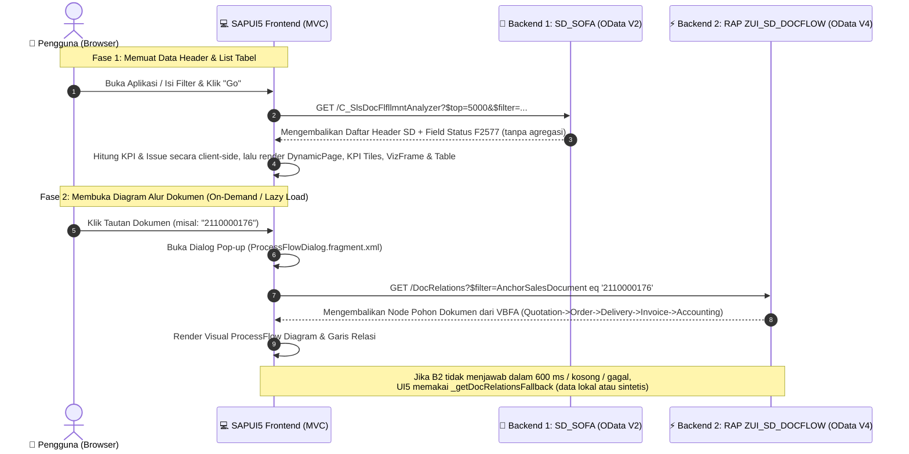

# 🏛️ Panduan Arsitektur Dual Backend SAP: Cara Kerja & Harmonisasi Layanan

Dokumen ini memberikan penjelasan menyeluruh mengenai arsitektur **Dual Backend (OData V2 + OData V4 RAP)** yang digunakan dalam aplikasi **SD Document Flow & Status Report**, bagaimana keduanya bekerja secara berkesinambungan, dan mengapa kedua layanan tersebut **tidak saling bertabrakan (*zero collision*)**.

---

## 📊 1. Diagram Arsitektur & Alur Interaksi (High-Level Diagram)



---

## 🔍 2. Peran & Tanggung Jawab Masing-Masing Backend

Kedua backend memiliki domain tugas yang sangat berbeda dan saling melengkapi (*complementary*):

| Kriteria | 🏢 Backend 1: Standard `SD_SOFA` | ⚡ Backend 2: Custom RAP `ZUI_SD_DOCFLOW` |
| :--- | :--- | :--- |
| **Protokol / Versi** | OData V2 (Standard SAP S/4HANA CDS) | OData V4 (Custom ABAP RAP S/4HANA 2025) |
| **Nama dataSource / model UI5** | dataSource `mainService` → model tanpa nama (`""`) | dataSource `rapService` → model `rapFlowService` |
| **Entity Utama** | `/C_SlsDocFlfllmntAnalyzer` | `/DocRelations` (Custom Entity `ZR_SD_DocRelation`) |
| **Bentuk Query Nyata** | `read("/C_SlsDocFlfllmntAnalyzer")` dengan `urlParameters: { $top: "5000" }` + hingga 9 filter. **Tanpa** `$select`, `$expand`, `$skip`, `$orderby`, `$count`, `$batch`. | `bindList("/DocRelations", null, null, [Filter(AnchorSalesDocument, EQ, doc)])` lalu `requestContexts()`. **Tanpa** `$select`, `$expand`, sorter. |
| **Fokus Tugas** | **Data Header & Analisis Status**: grid dokumen, filtering multi-field, pemetaan status 5-kode, dan agregasi KPI/issue *client-side*. | **Data Relasi Pohon Dokumen**: traversal tabel `VBFA` untuk menghasilkan rantai node diagram alur (*Parent $\rightarrow$ Children*). |
| **Waktu Panggilan (*Trigger*)** | Saat aplikasi pertama kali dibuka, saat "Go" ditekan, **dan pada setiap ketikan** di 7 filter input (`liveChange="onSearch"`, tanpa debounce). | **Hanya saat pengguna membuka Process Flow** untuk satu dokumen (*On-Demand / Lazy Loading*). |
| **Tipe Output** | Data datar tabular (Header Records). | Data pohon graf (*Hierarchical Graph / Nodes & Connections*). |
| **Caching / Batching** | Tidak ada. Setiap pencarian = satu read penuh `$top=5000`. Paging hanya di UI (`growingThreshold="100"`). | Tidak ada. Setiap pembukaan flow = satu `bindList` baru, tanpa memoisasi. |

> ⚠️ **Catatan performa**: karena 7 filter input memakai `liveChange="onSearch"` tanpa *debounce*, setiap penekanan tombol memicu satu request `$top=5000` ke Backend 1. Ini adalah *technical debt* yang perlu diperbaiki sebelum aplikasi dipakai produksi dengan volume data besar.


---

## 🛡️ 3. Mengapa Kedua Backend **TIDAK SALING BERTABRAKAN**?

Berikut adalah 4 alasan arsitektural mengapa kedua backend bekerja berdampingan dengan sangat stabil:

### 1. **Isolasi Model di Frontend (*Named Model Isolation*)**
Di dalam SAPUI5, kedua data source dipetakan ke dalam model instance yang terisolasi secara independen di [manifest.json](file:///d:/SAPUI5%20Projects/reportdocumentflowapp/webapp/manifest.json):
* **Default Model (`""`)**: Khusus terhubung ke OData V2 `SD_SOFA`.
* **Named Model (`"rapFlowService"`)**: Khusus terhubung ke OData V4 `ZUI_SD_DOCFLOW`.

Kedua model memiliki siklus hidup (*lifecycle*), context memori, serializer, dan HTTP client instance yang **terpisah 100%**.

```json
"models": {
    "": {
        "dataSource": "mainService",
        "preload": true,
        "settings": {
            "defaultBindingMode": "TwoWay",
            "defaultCountMode": "Inline",
            "refreshAfterChange": false,
            "metadataUrlParams": {
                "sap-value-list": "none"
            }
        }
    },
    "rapFlowService": {
        "dataSource": "rapService",
        "preload": false,
        "settings": {
            "synchronizationMode": "None",
            "operationMode": "Server"
        }
    }
}
```

> ℹ️ Perhatikan perbedaan nama: **dataSource** bernama `rapService`, sedangkan **model** bernama `rapFlowService`. Controller mengambilnya dengan `this.getView().getModel("rapFlowService")`.

---

### 2. **Pemisahan Waktu Eksekusi (*Temporal Separation / Lazy Loading*)**
* Backend 1 dan Backend 2 **tidak pernah dipanggil secara bersamaan** untuk query yang sama.
* Saat aplikasi melakukan search/filter di tabel utama, hanya **Backend 1** yang bekerja.
* **Backend 2 tidak disentuh sama sekali** sampai pengguna memutuskan untuk melihat detail alur dari satu dokumen spesifik.

> ⚠️ Klaim "mencegah lonjakan beban" hanya berlaku untuk Backend 2. Beban ke **Backend 1 justru tinggi** karena tidak ada *debounce* pada `liveChange="onSearch"` — setiap ketikan filter memicu satu read `$top=5000`.

---

### 3. **Pemisahan Sumber Data Database (*Database Layer Separation*)**
* **Backend 1** mengeksekusi Core Data Services (CDS) view analitik standar S/4HANA yang dioptimalkan untuk seleksi bulk header.
* **Backend 2** menjalankan class ABAP `ZCL_SD_DOCFLOW_QUERY` yang secara khusus melakukan rekursi tabel relasi `VBFA`, `VBAK`, `LIKP`, `VBRK`, dan `BKPF` untuk satu dokumen jangkar (*Anchor*).

---

### 4. **Jembatan Penghubung Tunggal (*Single Contract Key: VBELN*)**
Kesinambungan antar-layanan terjamin karena keduanya menggunakan satu kunci identitas bisnis yang identik, yaitu **Nomor Dokumen Penjualan (`SalesDocument` / `VBELN`)**:
1. Backend 1 menemukan dokumen `2110000176`.
2. Pengguna mengklik dokumen tersebut.
3. Controller meneruskan nomor `2110000176` sebagai parameter filter `$filter=AnchorSalesDocument eq '2110000176'` ke Backend 2.

---

## 🛟 3b. Perilaku Fallback Backend 2 (Penting)

Backend 2 **tidak dijamin** menjadi sumber data diagram alur. `_fetchDocRelations` memasang timer **600 ms**, dan `_getDocRelationsFallback` mengambil alih apabila salah satu terjadi:

1. Request OData V4 belum menjawab dalam 600 ms;
2. Response berhasil tetapi kosong (0 konteks);
3. Request ditolak / error.

Fallback bekerja dua tahap:

| Tahap | Sumber | Karakteristik |
| :--: | :--- | :--- |
| 1 | Kamus lokal `MASTER_DOC_RELATIONS` (10 nomor dokumen hardcoded: `70000009`, `70000013`, `2100000098`, `2110000174`, `2110000176`, `2110000177`, `2110000178`, `2110000179`, `2110000181`, `2110000182`) | Alur yang pernah disalin manual dari SAP; akurat untuk 10 dokumen tersebut. |
| 2 | Generator sintetis (jika nomor tidak terdaftar) | **Memfabrikasi** nomor dokumen turunan dari hash nomor anchor (prefiks `1511…`, `8110…`, `9110…`, `9000…`) dengan offset tanggal +7 / +10 / +14 hari. |

> ⚠️ **Implikasi operasional**: dalam kondisi jaringan lambat atau service RAP belum aktif, diagram Process Flow tetap tampil, namun untuk dokumen di luar 10 nomor tersebut isinya **bukan data SAP asli**. Verifikasi keaslian data dengan mengecek apakah pesan busy `"Loading Document Flow from S/4HANA RAP..."` sempat berganti data dalam <600 ms, atau naikkan ambang timer saat pengujian koneksi live.

---


## 🔄 4. Alur Kesinambungan Data (Data Continuity Flow)

> ℹ️ Rantai node di bawah bersifat **ilustratif** untuk menjelaskan bentuk data, bukan hasil query nyata dari sistem.

```
[ Backend 1: SD_SOFA ]
        │
        ▼ (Mengembalikan Baris Header)
  SalesDocument : "2110000176"
  Status        : "Partially Processed" (>>> / sap-icon://process)
  Phase         : "Accounting"
  Net Value     : "780,000 IDR"
        │
        │  (User Mengklik Link "2110000176" / baris tabel / tombol View Flow)
        ▼
[ Controller: _openDocumentFlow() -> _fetchDocRelations() ]
        │
        │  Meneruskan 'AnchorSalesDocument = 2110000176'
        ▼
[ Backend 2: RAP ZUI_SD_DOCFLOW ]
        │
        ▼ (Mengembalikan Struktur Node Alur dari VBFA — contoh bentuk data)
  ├─ Node 1: Sales Order      (2110000176) ──▶ SubsequentDocs: node_80000192
  ├─ Node 2: Outbound Delivery(80000192)   ──▶ SubsequentDocs: node_490000012,node_90000142
  ├─ Node 3: Goods Issue      (490000012)  ──▶ Selesai
  ├─ Node 4: Billing Document (90000142)   ──▶ SubsequentDocs: node_1400000012
  └─ Node 5: Accounting Doc   (1400000012) ──▶ Selesai (Current Active Phase)
        │
        ▼
[ Controller: _transformAndBindProcessFlow() ]
  - Petakan DocCategory -> laneId (5 lane), buang lane kosong, indeks ulang position
  - Petakan Status -> state UI5 (Positive/Critical/Negative/PlannedNeutral/Neutral)
  - children = SubsequentDocs.split(",")   ->  nodeId = "node_" + DocNumber
        │
        ▼
[ UI5: Render ProcessFlow Diagram Interaktif ]
```

---

## 🎯 5. Kesimpulan

Penggunaan arsitektur Dual Backend ini adalah **pendekatan yang tepat** dalam pengembangan SAP Fiori Freestyle modern ketika:
1. Kita ingin memanfaatkan fungsionalitas analitik matang dari standar SAP Fiori (*Track Sales Orders*).
2. Sekaligus membutuhkan diagram alur visual interaktif kustom yang tidak disediakan oleh layanan standar OData bawaan SAP.

Kedua backend terisolasi di sisi model UI5 dan tidak berbagi *lifecycle*, sehingga **tidak ada risiko konflik data antar-layanan**.

### Hal yang Masih Perlu Diselesaikan

| Isu | Dampak |
| :--- | :--- |
| Fallback sintetis pada Process Flow | Diagram bisa menampilkan nomor dokumen fabrikasi bila Backend 2 lambat/belum aktif. Perlu indikator visual "data fallback" atau timer yang dapat dikonfigurasi. |
| Tidak ada *debounce* pada filter | Beban berlebih ke Backend 1 (`$top=5000` per ketikan). |
| Tidak ada `$select` | Payload lebih besar dari yang dibutuhkan (13 kolom dipakai dari puluhan field CDS). |
| Entity `DocHeader` belum dipakai | Service RAP terpadu baru dimanfaatkan setengahnya; header masih dari OData V2. |

