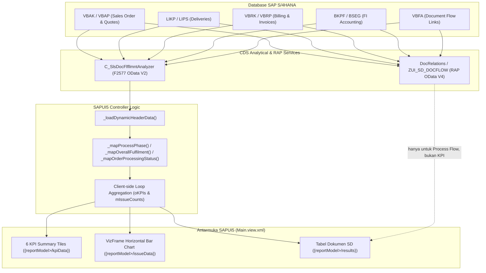

# 📐 Dokumentasi Perhitungan KPI Summary & Total Issues (Step-by-Step)

Dokumen ini menjelaskan secara rinci alur, logika bisnis, rumus perhitungan, dan pemetaan field database SAP S/4HANA untuk:
1. **6 Kartu Ringkasan Dokumen (*KPI Summary Tiles*)**: *Inquiry, Delivery, Quotation, Billing, Sales Order, Payment*.
2. **Grafik Batang Isu Operasional (*Total Issues Bar Chart*)**: *Open Sales Order, Open Inquiry Document, Open Delivery Document, Ready to Goods Issue, Pending Approval, Not Yet Payment*.

> Referensi baris kode mengacu pada [webapp/controller/Main.controller.js](file:///webapp/controller/Main.controller.js). Nomor baris dapat bergeser jika kode diubah.

---

## ⚠️ Ringkasan Penting Sebelum Membaca

| Fakta | Penjelasan |
| :--- | :--- |
| **Sumber data** | Seluruh KPI & issue dihitung dari **hasil live OData V2**, bukan dari `MASTER_DOC_HEADERS`. Perhitungan berada di dalam *success handler* `_loadDynamicHeaderData` (L2615–2665). |
| **Kapan dihitung** | Setiap kali `onSearch` berhasil mengembalikan data. Jika 0 record atau error, semua KPI di-set `0` dan `/issueData` dikosongkan (L2677–2684, L2698–2705). |
| **Cara hitung** | *Client-side*, satu iterasi `forEach` atas array hasil. Tidak ada `$apply` / `GroupBy` di sisi server. |
| **Batasan besar** | Query **selalu** memfilter `SDDocumentCategory EQ <tipe terpilih>`, dan dropdown UI saat ini **hanya menyediakan opsi `C` (Sales Order)**. Konsekuensinya di jalur live: `salesOrder` = jumlah total baris, sedangkan `inquiry`, `quotation`, `delivery`, dan `billing` **selalu `0`**; issue `Open Inquiry Document` dan `Open Delivery Document` juga **selalu `0`**. |
| **Kode mati** | `_applyLocalFilter` (L2991) berisi versi alternatif perhitungan dengan nilai tetap, tetapi fungsi itu **tidak pernah dipanggil**. Lihat Lampiran di bagian 6. |

---

## 🏗️ 1. Diagram Alur Data (End-to-End Data Flow)



---

## 📊 2. Perhitungan 6 KPI Summary Tiles (`kpiData`)

### Step 1: Ekstraksi Kategori Dokumen (`SDDocumentCategory` / `VBTYP`)

Setiap dokumen SD memiliki kategori pada field `VBTYP` (`SDDocumentCategory` di CDS View). Nilai ini dipetakan ke properti baris `documentCategory`:

* `'A'` = Inquiry
* `'B'` = Quotation
* `'C'` = Sales Order
* `'J'` = Delivery (Outbound)
* `'M'` = Invoice / Billing

### Step 2: Aturan Perhitungan Nyata (L2632–2641)

Implementasi menggunakan **rantai `else if` yang saling eksklusif** untuk 5 KPI pertama, dengan kondisi **`documentCategory` ATAU `processPhase`**. KPI `payment` adalah **counter independen** di luar rantai tersebut.

| # | KPI | Kondisi Nyata di Kode | Baris |
| :--: | :--- | :--- | :--- |
| 1️⃣ | **Inquiry** | `documentCategory === "A"` **‖** `processPhase === "Inquiry"` | 2633 |
| 2️⃣ | **Quotation** | *else if* `documentCategory === "B"` **‖** `processPhase === "Quotation"` | 2634 |
| 3️⃣ | **Sales Order** | *else if* `documentCategory === "C"` **‖** `processPhase === "Order Processing"` | 2635 |
| 4️⃣ | **Delivery** | *else if* `documentCategory === "J"` **‖** `processPhase === "Delivery Processing"` | 2636 |
| 5️⃣ | **Billing** | *else if* `documentCategory === "M"` **‖** `processPhase === "Invoicing"` **‖** `processPhase === "Accounting"` | 2637 |
| 6️⃣ | **Payment** | **Independen** (bukan bagian rantai): `processPhase === "Already Payment"` **‖** `overallFulfilmentText === "Completely Processed"` | 2639–2641 |

```javascript
aDynamicRows.forEach(function (r) {
    if (r.documentCategory === "A" || r.processPhase === "Inquiry") oKPIs.inquiry++;
    else if (r.documentCategory === "B" || r.processPhase === "Quotation") oKPIs.quotation++;
    else if (r.documentCategory === "C" || r.processPhase === "Order Processing") oKPIs.salesOrder++;
    else if (r.documentCategory === "J" || r.processPhase === "Delivery Processing") oKPIs.delivery++;
    else if (r.documentCategory === "M" || r.processPhase === "Invoicing" || r.processPhase === "Accounting") oKPIs.billing++;

    if (r.processPhase === "Already Payment" || r.overallFulfilmentText === "Completely Processed") {
        oKPIs.payment++;
    }
    // ... lanjut ke klasifikasi issue (lihat bagian 3)
});
```

> ⚠️ **Konsekuensi rantai eksklusif + filter kategori**: karena setiap baris pasti berkategori `C`, cabang ketiga selalu `TRUE` lebih dulu. Maka `salesOrder` = total baris, dan `inquiry` / `quotation` / `delivery` / `billing` tetap `0`. Keenam tile baru akan terisi bervariasi jika dropdown *SD Document Type* diperluas ke `A`, `B`, `J`, `M`, atau jika filter kategori dilonggarkan.

> 🐛 **`"Already Payment"` tidak pernah muncul**: `_mapProcessPhase` tidak pernah mengembalikan nilai itu, sehingga KPI Payment praktis hanya bergantung pada `overallFulfilmentText === "Completely Processed"`.

### Step 3: Logika Setara di Sisi CDS (Referensi / Belum Diimplementasi)

Jika perhitungan ingin dipindahkan ke sisi backend agar tidak bergantung pada filter kategori tunggal, ekspresi CDS yang setara adalah:

```sql
SUM( CASE WHEN SDDocumentCategory = 'A' THEN 1 ELSE 0 END ) AS TotalInquiry,
SUM( CASE WHEN SDDocumentCategory = 'B' THEN 1 ELSE 0 END ) AS TotalQuotation,
SUM( CASE WHEN SDDocumentCategory = 'C' THEN 1 ELSE 0 END ) AS TotalSalesOrder,
SUM( CASE WHEN SDDocumentCategory = 'J' THEN 1 ELSE 0 END ) AS TotalDelivery,
SUM( CASE WHEN SDDocumentCategory = 'M' THEN 1 ELSE 0 END ) AS TotalBilling,
SUM( CASE WHEN FulfillmentStatusInAccounting = '3'
            OR OverallSDProcessStatus = 'C' THEN 1 ELSE 0 END ) AS TotalPayment
```

**Status: belum diimplementasi di backend.** Aplikasi saat ini murni menghitung di frontend.

---

## 📈 3. Perhitungan Grafik "Total Issues" (`issueData`)

Grafik batang (*Horizontal Bar Chart*) mengelompokkan dokumen berdasarkan kendala alur operasional.

### 3.1 Implementasi Frontend Saat Ini (L2643–2658) — Faktual

Frontend **hanya membandingkan string** hasil pemetaan (`overallFulfilmentText`, `statusState`) dan `documentCategory`. Frontend **tidak** mengevaluasi satu pun field mentah SAP seperti `LFSTK`, `WBSTK`, `GBSTK`, `ABSTK`, atau `FulfillmentStatusInAccounting`.

| Kategori Isu di Chart | Kondisi Nyata di Kode | Tipe | Baris |
| :--- | :--- | :--- | :--- |
| **Pending Approval** | `overallFulfilmentText === "Issue : Action Overdue"` **‖** `statusState === "Error"` | rantai `if` | 2643–2644 |
| **Ready to Goods Issue** | *else if* `overallFulfilmentText === "Partially Processed"` | rantai `else if` | 2645–2646 |
| **Not Yet Payment** | *else if* `overallFulfilmentText === "Not Yet Processed"` | rantai `else if` | 2647–2648 |
| **Open Sales Order** | `documentCategory === "C"` **&&** `overallFulfilmentText !== "Completely Processed"` | independen | 2650–2652 |
| **Open Inquiry Document** | `documentCategory === "A"` **&&** `overallFulfilmentText !== "Completely Processed"` | independen | 2653–2655 |
| **Open Delivery Document** | `documentCategory === "J"` **&&** `overallFulfilmentText !== "Completely Processed"` | independen | 2656–2658 |

Karakteristik penting:
* Tiga kategori pertama **saling eksklusif** (satu dokumen hanya masuk salah satunya).
* Tiga kategori `Open *` bersifat **independen**, sehingga satu dokumen bisa terhitung di `Pending Approval` **dan** `Open Sales Order` sekaligus.
* **Tidak ada logika ambang batas (*threshold*) maupun perhitungan umur/tanggal** — murni kesetaraan string status.
* Karena filter kategori `C`, `Open Inquiry Document` dan `Open Delivery Document` **selalu `0`**.

### 3.2 Matriks Logika Bisnis yang Dituju (Level CDS / Backend) — Belum Diimplementasi

Tabel berikut adalah **desain logika bisnis ideal** berbasis field mentah SAP. Ini **bukan** deskripsi kode frontend saat ini; gunakan sebagai spesifikasi jika perhitungan dipindahkan ke CDS View.

| Kategori Isu | Kondisi Field SAP S/4HANA yang Dituju | Logika Bisnis |
| :--- | :--- | :--- |
| **Open Sales Order** | `SDDocumentCategory = 'C'` & `GBSTK != 'C'` | Order penjualan yang status keseluruhannya belum selesai. |
| **Open Inquiry Document** | `SDDocumentCategory = 'A'` & `GBSTK != 'C'` | Permintaan harga yang belum ditindaklanjuti. |
| **Open Delivery Document** | `SDDocumentCategory = 'J'` & `LFSTK != 'C'` | Delivery yang masih dalam proses gudang. |
| **Ready to Goods Issue** | `LFSTK = 'B'` / `FulfillmentStatusInDelivery = '2'` | Barang sudah dipick dan siap Post Goods Issue (PGI). |
| **Pending Approval / Overdue** | `OverallFulfillmentStatus = '4'` / `ABSTK = 'C'` / `LIFSK <> ''` / `FAKSK <> ''` | Dokumen terkena blokir atau melewati SLA. |
| **Not Yet Payment** | `FulfillmentStatusInAccounting IN ('1','2')` | Faktur sudah terbit namun belum lunas. |

**Jembatan antara 3.1 dan 3.2**: kondisi mentah di atas sebagian sudah terserap secara tidak langsung, karena `_mapOverallFulfilment` menerjemahkan `OverallFulfillmentStatus` `'1'`–`'5'` (dan blokir/rejection) menjadi teks `Not Yet Processed` / `Partially Processed` / `Completely Processed` / `Issue : Action Overdue` / `Due Next Issue` yang kemudian dibandingkan oleh logika issue.

> 🐛 Status `'5'` (**Due Next Issue**) tidak dipetakan ke bucket issue mana pun, sehingga dokumen berstatus peringatan dini tidak muncul di grafik.

---

## ⚙️ 4. Implementasi Step-by-Step pada Kode Controller

Berikut alur eksekusi nyata di [Main.controller.js](file:///webapp/controller/Main.controller.js), seluruhnya di dalam *success handler* `_loadDynamicHeaderData`.

### Step 1: Inisialisasi Counter (L2615–2630)
```javascript
var oKPIs = {
    inquiry: 0,
    quotation: 0,
    salesOrder: 0,
    delivery: 0,
    billing: 0,
    payment: 0
};
var mIssueCounts = {
    "Open Sales Order": 0,
    "Open Inquiry Document": 0,
    "Open Delivery Document": 0,
    "Ready to Goods Issue": 0,
    "Pending Approval": 0,
    "Not Yet Payment": 0
};
```

### Step 2: Iterasi & Klasifikasi Dokumen Live (L2632–2659)
```javascript
// aDynamicRows = hasil read("/C_SlsDocFlfllmntAnalyzer") yang sudah dipetakan
aDynamicRows.forEach(function (r) {
    // 1. Klasifikasi KPI Summary (rantai eksklusif untuk 5 KPI pertama)
    if (r.documentCategory === "A" || r.processPhase === "Inquiry") oKPIs.inquiry++;
    else if (r.documentCategory === "B" || r.processPhase === "Quotation") oKPIs.quotation++;
    else if (r.documentCategory === "C" || r.processPhase === "Order Processing") oKPIs.salesOrder++;
    else if (r.documentCategory === "J" || r.processPhase === "Delivery Processing") oKPIs.delivery++;
    else if (r.documentCategory === "M" || r.processPhase === "Invoicing" || r.processPhase === "Accounting") oKPIs.billing++;

    // 2. KPI Payment: counter independen
    if (r.processPhase === "Already Payment" || r.overallFulfilmentText === "Completely Processed") {
        oKPIs.payment++;
    }

    // 3. Klasifikasi Isu Operasional (rantai eksklusif)
    if (r.overallFulfilmentText === "Issue : Action Overdue" || r.statusState === "Error") {
        mIssueCounts["Pending Approval"]++;
    } else if (r.overallFulfilmentText === "Partially Processed") {
        mIssueCounts["Ready to Goods Issue"]++;
    } else if (r.overallFulfilmentText === "Not Yet Processed") {
        mIssueCounts["Not Yet Payment"]++;
    }

    // 4. Klasifikasi Open Documents (independen, per kategori)
    if (r.documentCategory === "C" && r.overallFulfilmentText !== "Completely Processed") {
        mIssueCounts["Open Sales Order"]++;
    }
    if (r.documentCategory === "A" && r.overallFulfilmentText !== "Completely Processed") {
        mIssueCounts["Open Inquiry Document"]++;
    }
    if (r.documentCategory === "J" && r.overallFulfilmentText !== "Completely Processed") {
        mIssueCounts["Open Delivery Document"]++;
    }
});
```

> ℹ️ Perhatikan bahwa `mIssueCounts["Open Sales Order"]` **diakumulasi per baris dengan syarat `!== "Completely Processed"`**, bukan disalin dari nilai `oKPIs.salesOrder`. Kedua angka itu berbeda: KPI `Sales Order` menghitung **semua** order, sedangkan `Open Sales Order` hanya yang **belum selesai**.

### Step 3: Binding Data ke Model Antarmuka (L2661–2665)
```javascript
// 1. Update data KPI Tiles
oReportModel.setProperty("/kpiData", oKPIs);

// 2. Transformasi objek issues menjadi array untuk VizFrame Chart
var aIssueData = Object.keys(mIssueCounts).map(function (k) {
    return { issueType: k, count: mIssueCounts[k] };
});
oReportModel.setProperty("/issueData", aIssueData);
```

Urutan kunci `mIssueCounts` menentukan urutan batang di grafik: `Open Sales Order` → `Open Inquiry Document` → `Open Delivery Document` → `Ready to Goods Issue` → `Pending Approval` → `Not Yet Payment`.

### Step 4: Perilaku pada Kondisi 0 Record / Error
```javascript
// 0 record (L2677–2684) dan error handler (L2698–2705) melakukan hal yang sama:
oReportModel.setProperty("/kpiData", { inquiry: 0, delivery: 0, quotation: 0, billing: 0, salesOrder: 0, payment: 0 });
oReportModel.setProperty("/issueData", []);
```

---

## 📋 5. Ringkasan Kamus Field Database SAP (Data Dictionary)

| Nama Field SAP | Deskripsi Standar SAP | Digunakan Untuk | Dibaca Frontend? |
| :--- | :--- | :--- | :--: |
| `VBAK-VBTYP` / `SDDocumentCategory` | SD Document Category (`A`, `B`, `C`, `J`, `M`) | Identifikasi tipe dokumen pada KPI Tiles & Open Documents | ✅ |
| `OverallFulfillmentStatus` | Status pemenuhan menyeluruh F2577 (`1`–`5`) | Sumber utama `overallFulfilmentText` yang dipakai logika issue | ✅ |
| `VBAK-ABSTK` / `OverallSDRejectionStatus` | Overall Rejection Status (`A`=Not rejected, `C`=Completely rejected) | Fallback penentuan `Issue : Action Overdue` | ✅ |
| `VBAK-GBSTK` / `OverallSDProcessStatus` | Overall Processing Status (`A`=Open, `B`=In Process, `C`=Completed) | Fallback penentuan status | ✅ |
| `LIKP-LFSTK` / `OverallTotalDeliveryStatus` | Overall Delivery Status (`A`/`B`/`C`) | Fallback status & penentuan fase Delivery | ✅ |
| `HeaderBillingBlockReason` | Billing Block (`FAKSK`) | Penentuan fase `Invoicing` | ✅ |
| `FulfillmentStatusInAccounting` | Status pembukuan FI (`1`=Not processed, `2`=In process, `3`=Cleared) | Penentuan fase `Accounting` | ✅ |
| `LIKP-WBSTK` / `GoodsMovementStatus` | Total Goods Movement Status (`A`/`B`/`C`) | Direncanakan untuk `Ready to Goods Issue` | ❌ Belum |
| `FulfillmentStatusInSupply` | Status tahap pasokan | Direncanakan untuk fase Delivery | ❌ Belum |
| `FulfillmentStatusInTransit` | Status tahap transit | Direncanakan untuk `In Transit` | ❌ Belum |

---

## 📎 6. Lampiran: Nilai pada Kode Mati (`_applyLocalFilter`)

Fungsi `_applyLocalFilter` (L2991) tidak pernah dipanggil, tetapi bila suatu saat diaktifkan kembali, ia menghasilkan angka **tetap** yang berbeda total dari jalur live. Dicatat di sini agar tidak tertukar saat *debugging*:

**KPI tetap (L3193–3200)**: `inquiry: 36`, `delivery: 72`, `quotation: 42`, `billing: 78`, `salesOrder: 60`, `payment: 50`.

**Issue tetap (L3202–3207)** — hanya **4 bucket** dengan nama berbeda:

| Nama Bucket di Kode Mati | Nilai | Catatan |
| :--- | :--: | :--- |
| `Not Yet Payment` | 70 | sama namanya dengan jalur live |
| `Ready to Good Issue` | 13 | ⚠️ typo — jalur live memakai `Ready to Goods Issue` |
| `Open Sales Order` | 52 | sama namanya dengan jalur live |
| `Open Inquiry` | 24 | ⚠️ jalur live memakai `Open Inquiry Document` |

Nilai `36 / 72 / 42 / 78 / 60 / 50` inilah yang dulu tertulis sebagai angka contoh di `README.md`. Angka tersebut **bukan** data nyata dan sudah dihapus dari dokumentasi.
