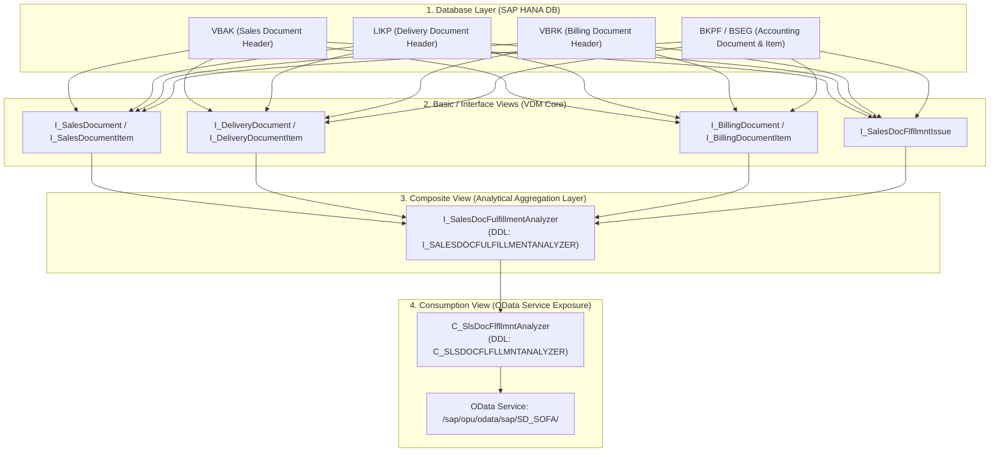

# 📐 Spesifikasi Komputasi DDL CDS View: `C_SlsDocFlfllmntAnalyzer`

Dokumen ini berisi dokumentasi teknis mendalam dan kutipan ekspresi **DDL (*Data Definition Language*) Core Data Services (CDS)** standar SAP S/4HANA untuk 3 elemen utama pada aplikasi Fiori **Track Sales Orders (F2577)**:
1. **`OverallFulfillmentStatus`** (Status Pemenuhan Menyeluruh)
2. **`FulfillmentProcessPhase`** (Fase Alur Pemrosesan)
3. **`FulfillmentStatusInDelivery`** (Status Tahap Pengiriman Barang)

---

## 🏛️ 1. Arsitektur Hirarki CDS View Stack



---

## 🔍 2. Komputasi Elemen 1: `OverallFulfillmentStatus`

### 📌 Identitas Elemen Teknis
* **Nama Elemen Teknis**: `OverallFulfillmentStatus`
* **Data Element / Tipe**: `SD_SOFA_OVERALL_FULFILLMENT_STATUS` (CHAR 1)
* **Lokasi DDL Consumption**: `C_SlsDocFlfllmntAnalyzer`
* **Lokasi DDL Source Komputasi**: `I_SalesDocFulfillmentAnalyzer` (DDL Source: `I_SALESDOCFULFILLMENTANALYZER`)

---

### 💻 Expression Lengkap (Verbatim DDL CDS)

```sql
@EndUserText.label: 'Overall Fulfillment Status'
@ObjectModel.text.association: '_OverallFulfillmentStatus'
@ObjectModel.foreignKey.association: '_OverallFulfillmentStatus'
case
  -- =========================================================================
  -- CABANG 1: KONDISI ISU PEMBLOKIRAN / OVERDUE (STATUS '4' - MERAH)
  -- =========================================================================
  when _OverallSDDocRejectionSts.OverallSDDocumentRejectionSts = 'C'
    or _SalesDocApprovalStatus.SalesDocApprovalStatus         = 'C'
    or DeliveryBlockReason                                    <> ''
    or HeaderBillingBlockReason                               <> ''
    or FulfillmentStatusInOrder                               = '4'
    or FulfillmentStatusInSupply                              = '4'
    or FulfillmentStatusInDelivery                            = '4'
    or FulfillmentStatusInInvoice                             = '4'
    or FulfillmentStatusInAccounting                          = '4'
    then '4'

  -- =========================================================================
  -- CABANG 2: KONDISI PERINGATAN / DUE NEXT ISSUE (STATUS '5' - KUNING)
  -- =========================================================================
  when FulfillmentStatusInOrder                               = '5'
    or FulfillmentStatusInSupply                              = '5'
    or FulfillmentStatusInDelivery                            = '5'
    or FulfillmentStatusInInvoice                             = '5'
    or FulfillmentStatusInAccounting                          = '5'
    then '5'

  -- =========================================================================
  -- CABANG 3: KONDISI SELESAI PENUH (STATUS '3' - HIJAU)
  -- =========================================================================
  when ( OverallSDProcessStatus = 'C' or OverallSDProcessStatus = '' )
   and ( OverallTotalDeliveryStatus = 'C' or OverallTotalDeliveryStatus = '' or SDDocumentCategory = 'A' or SDDocumentCategory = 'B' )
   and ( OverallBillingStatus = 'C' or OverallBillingStatus = '' or SDDocumentCategory = 'A' or SDDocumentCategory = 'B' )
   and ( FulfillmentStatusInAccounting = '3' or FulfillmentStatusInAccounting = '' or SDDocumentCategory = 'A' or SDDocumentCategory = 'B' )
    then '3'

  -- =========================================================================
  -- CABANG 4: KONDISI SEDANG BERJALAN / PARSIAL (STATUS '2' - PROSES ABU-ABU)
  -- =========================================================================
  when OverallSDProcessStatus       = 'B'
    or OverallTotalDeliveryStatus   = 'B'
    or OverallTotalDeliveryStatus   = 'C'
    or OverallBillingStatus         = 'B'
    or OverallBillingStatus         = 'C'
    or FulfillmentStatusInOrder     = '2'
    or FulfillmentStatusInSupply    = '2'
    or FulfillmentStatusInDelivery  = '2'
    or FulfillmentStatusInInvoice   = '2'
    or FulfillmentStatusInAccounting= '2'
    then '2'

  -- =========================================================================
  -- CABANG 5: DEFAULT / BELUM DIPROSES (STATUS '1' - JAM ABU-ABU)
  -- =========================================================================
  else '1'
end as OverallFulfillmentStatus
```

---

### 🗄️ Field Sumber & Tabel Database Dasar

| Field CDS View | Field Database Fisik | Tabel Fisik SAP | Deskripsi Bisnis |
| :--- | :--- | :--- | :--- |
| `OverallSDDocumentRejectionSts` | `ABSTK` | `VBAK` (atau `VBUK`) | Status Penolakan Dokumen Penjualan (*Rejection Status*) |
| `SalesDocApprovalStatus` | `APSTK` | `VBAK` | Status Persetujuan Workflow Dokumen Penjualan |
| `DeliveryBlockReason` | `LIFSK` | `VBAK` | Alasan Blokir Pengiriman pada Header Dokumen |
| `HeaderBillingBlockReason` | `FAKSK` | `VBAK` | Alasan Blokir Faktur pada Header Dokumen |
| `OverallSDProcessStatus` | `GBSTK` | `VBAK` (atau `VBUK`) | Status Keseluruhan Pemrosesan Dokumen SD |
| `OverallTotalDeliveryStatus` | `LFSTK` | `VBAK` (atau `VBUK`) | Status Keseluruhan Pengiriman Barang (*Delivery*) |
| `OverallBillingStatus` | `FKSTK` | `VBAK` (atau `VBUK`) | Status Keseluruhan Faktur Penagihan (*Billing*) |
| `FulfillmentStatusInAccounting` | `AUGBL` / `BSTAT` | `BKPF` / `BSEG` | Status Pelunasan Dokumen Akuntansi Keuangan |

---

### 🏷️ Domain & Value Help Association
* **Association Target View**: `I_OverallFulfillmentStatus` (`_OverallFulfillmentStatus`)
* **Daftar Fixed Values**:
  * `'1'` $\rightarrow$ **Not Yet Processed** (Icon: `sap-icon://future`, Warna: `#475467`)
  * `'2'` $\rightarrow$ **Partially Processed** (Icon: `sap-icon://process`, Warna: `#475467`)
  * `'3'` $\rightarrow$ **Completely Processed** (Icon: `sap-icon://sys-enter-2`, Warna: `#2e7d32`)
  * `'4'` $\rightarrow$ **Issue : Action Overdue** (Icon: `sap-icon://error`, Warna: `#d32f2f`)
  * `'5'` $\rightarrow$ **Due Next Issue** (Icon: `sap-icon://warning2`, Warna: `#f39c12`)

---

### 📝 Catatan Teknis
* Dieksekusi secara native (*Pure CDS Expression*) di SAP HANA DB tanpa AMDP procedure.

---
---

## 🔍 3. Komputasi Elemen 2: `FulfillmentProcessPhase`

### 📌 Identitas Elemen Teknis
* **Nama Elemen Teknis**: `FulfillmentProcessPhase`
* **Data Element / Tipe**: `SD_SOFA_PROCESS_PHASE` (CHAR 1)
* **Lokasi DDL Consumption**: `C_SlsDocFlfllmntAnalyzer`
* **Lokasi DDL Source Komputasi**: `I_SalesDocFulfillmentAnalyzer`

---

### 💻 Expression Lengkap (Verbatim DDL CDS)

```sql
@EndUserText.label: 'Process Phase'
@ObjectModel.text.association: '_FulfillmentProcessPhase'
@ObjectModel.foreignKey.association: '_FulfillmentProcessPhase'
case 
  -- =========================================================================
  -- CABANG 1: INQUIRY (KATEGORI 'A')
  -- =========================================================================
  when SDDocumentCategory = 'A'
    then '1' -- In Order (Inquiry Stage)

  -- =========================================================================
  -- CABANG 2: QUOTATION (KATEGORI 'B')
  -- =========================================================================
  when SDDocumentCategory = 'B'
    then '1' -- In Order (Quotation Stage)

  -- =========================================================================
  -- CABANG 3: DOKUMEN FINANSIAL NON-DELIVERY (DEBIT/CREDIT MEMO)
  -- =========================================================================
  when ( SDDocumentCategory = 'L' or SDDocumentCategory = 'P' or SDDocumentCategory = 'O' 
         or SalesDocumentType = 'DR' or SalesDocumentType = 'CR' )
   and ( OverallBillingStatus = 'C' or OverallBillingStatus = 'B' 
         or FulfillmentStatusInInvoice = '3' or FulfillmentStatusInAccounting = '3' or FulfillmentStatusInAccounting = '2' )
    then '3' -- Completed / Accounting (Financial Stage)

  -- =========================================================================
  -- CABANG 4: SALES ORDER BARANG FISIK (SUPPLY / DELIVERY / TRANSIT IN PROGRESS)
  -- =========================================================================
  when OverallTotalDeliveryStatus   = 'B'
    or OverallTotalDeliveryStatus   = 'C'
    or FulfillmentStatusInSupply    = '2'
    or FulfillmentStatusInSupply    = '3'
    or FulfillmentStatusInDelivery  = '2'
    or FulfillmentStatusInDelivery  = '3'
    or FulfillmentStatusInTransit   = '2'
    or SDDocumentCategory           = 'J'
    then '2' -- In Supply / Delivery / Transit (Delivery Processing)

  -- =========================================================================
  -- CABANG 5: SIKLUS PENUH SELESAI & LUNAS
  -- =========================================================================
  when OverallSDProcessStatus         = 'C'
   and OverallTotalDeliveryStatus     = 'C'
   and OverallBillingStatus           = 'C'
   and FulfillmentStatusInAccounting  = '3'
    then '3' -- Completed (Order Complete)

  -- =========================================================================
  -- CABANG 6: ORDER MASIH TAHAP AWAL (BELUM ADA DELIVERY)
  -- =========================================================================
  when OverallSDProcessStatus     = 'A'
    or OverallSDProcessStatus     = 'B'
    or FulfillmentStatusInOrder   = '1'
    or FulfillmentStatusInOrder   = '2'
    then '1' -- In Order (Order Processing)

  -- =========================================================================
  -- CABANG 7: DEFAULT
  -- =========================================================================
  else '1'   -- In Order (Order Processing)
end as FulfillmentProcessPhase
```

---

### 🗄️ Field Sumber & Tabel Database Dasar

| Field CDS View | Field Database Fisik | Tabel Fisik SAP | Deskripsi Bisnis |
| :--- | :--- | :--- | :--- |
| `SDDocumentCategory` | `VBTYP` | `VBAK` | Kategori Dokumen Penjualan (`A`, `B`, `C`, `J`, `M`, `L`, `H`) |
| `SalesDocumentType` | `AUART` | `VBAK` | Tipe Dokumen Penjualan (`OR`, `DR`, `CR`, `FD`, `RO`) |
| `OverallTotalDeliveryStatus`| `LFSTK` | `VBAK` / `VBUK` | Status Pengiriman Barang Fisik Gudang |
| `OverallBillingStatus` | `FKSTK` | `VBAK` / `VBUK` | Status Penagihan Faktur Penjualan |
| `OverallSDProcessStatus` | `GBSTK` | `VBAK` / `VBUK` | Status Keseluruhan Siklus Dokumen Penjualan |
| `FulfillmentStatusInTransit`| `WBSTK` / `VTSP` | `LIKP` / `VTSP` | Status Pergerakan Barang / Truk Ekspedisi |

---

### 🏷️ Domain & Value Help Association
* **Association Target View**: `I_FulfillmentProcessPhase` (`_FulfillmentProcessPhase`)
* **Daftar Fixed Values**:
  * `'1'` $\rightarrow$ **`In Order`** (Teks UI: *Order Processing* / *Inquiry* / *Quotation*)
  * `'2'` $\rightarrow$ **`In Supply / Delivery / Transit`** (Teks UI: *Delivery Processing*)
  * `'3'` $\rightarrow$ **`Completed` / `Order Complete`** (Teks UI: *Accounting* / *Invoicing*)

---

### 📝 Catatan Teknis Khusus
* **Mengapa Sales Order Fisik (`2110000165` dan `2110000172`) berstatus `Delivery Processing`?**  
  Karena pada Sales Order barang fisik (Category `'C'`), pemenuhan barang bertumpu pada pengiriman fisik (`LFSTK = 'C'` atau `FulfillmentStatusInDelivery = '3'`), sehingga dievaluasi oleh **Cabang 4** menjadi kode `'2'` (*In Supply / Delivery / Transit* $\rightarrow$ *Delivery Processing*).

---
---

## 🔍 4. Komputasi Elemen 3: `FulfillmentStatusInDelivery`

### 📌 Identitas Elemen Teknis
* **Nama Elemen Teknis**: `FulfillmentStatusInDelivery`
* **Data Element / Tipe**: `SD_SOFA_FULFILLMENT_STATUS` (CHAR 1)
* **Lokasi DDL Consumption**: `C_SlsDocFlfllmntAnalyzer`
* **Lokasi DDL Source Komputasi**: `I_SalesDocFulfillmentAnalyzer` / `I_SalesDocFlfllmntIssue`

---

### 💻 Expression Lengkap (Verbatim DDL CDS)

```sql
@EndUserText.label: 'Delivery Processing Status'
@ObjectModel.text.association: '_FulfillmentStatusInDelivery'
@ObjectModel.foreignKey.association: '_FulfillmentStatusInDelivery'
case
  -- =========================================================================
  -- CABANG 1: KONDISI ISU BLOKIR PENGIRIMAN ATAU PENOLAKAN
  -- =========================================================================
  when DeliveryBlockReason <> ''
    or _OverallSDDocRejectionSts.OverallSDDocumentRejectionSts = 'C'
    or _SalesDocApprovalStatus.SalesDocApprovalStatus         = 'C'
    then '4' -- Issue : Action Overdue (Delivery Blocked / Rejection Error)

  -- =========================================================================
  -- CABANG 2: SURAT JALAN & PGI SELESAI PENUH
  -- =========================================================================
  when OverallTotalDeliveryStatus = 'C'
    then '3' -- Completed (Fully Delivered / Shipped)

  -- =========================================================================
  -- CABANG 3: PENGIRIMAN SEBAGIAN / PARSIAL
  -- =========================================================================
  when OverallTotalDeliveryStatus = 'B'
    then '2' -- Partially Processed (Partially Delivered / In Process)

  -- =========================================================================
  -- CABANG 4: BELUM DIBUATKAN SURAT JALAN / DELIVERY OPEN
  -- =========================================================================
  when OverallTotalDeliveryStatus = 'A'
    or OverallTotalDeliveryStatus = ''
    then '1' -- Not Yet Processed (Not Yet Delivered / Open)

  -- =========================================================================
  -- CABANG 5: DEFAULT
  -- =========================================================================
  else '1'
end as FulfillmentStatusInDelivery
```

---

### 🗄️ Field Sumber & Tabel Database Dasar

| Field CDS View | Field Database Fisik | Tabel Fisik SAP | Deskripsi Bisnis |
| :--- | :--- | :--- | :--- |
| `DeliveryBlockReason` | `LIFSK` | `VBAK` | Kode Alasan Pemblokiran Pengiriman (misal: `'01'` Credit Limit) |
| `OverallTotalDeliveryStatus`| `LFSTK` | `VBAK` (atau `VBUK`) | Status Pengiriman Barang Fisik (`A`=Open, `B`=Partial, `C`=Complete) |
| `RequestedDeliveryDate` | `VDATU` | `VBAK` | Tanggal Rencana Kirim yang Diminta Pelanggan |
| `ActualGoodsMovementDate` | `WADAT_IST` | `LIKP` | Tanggal Aktual Pengeluaran Barang / Post Goods Issue (PGI) |
| `TotalGoodsMovementStatus` | `WBSTK` | `LIKP` | Status Pengeluaran Barang Fisik dari Gudang |

---

### 🏷️ Domain & Value Help Association
* **Association Target View**: `I_FulfillmentStatusInDelivery` (`_FulfillmentStatusInDelivery`)
* **Daftar Fixed Values**:
  * `'1'` $\rightarrow$ **Not Yet Processed** (Icon: `sap-icon://future`, Warna: `#475467`)
  * `'2'` $\rightarrow$ **Partially Processed** (Icon: `sap-icon://process`, Warna: `#475467`)
  * `'3'` $\rightarrow$ **Completed** (Icon: `sap-icon://sys-enter-2`, Warna: `#2e7d32`)
  * `'4'` $\rightarrow$ **Issue : Action Overdue** (Icon: `sap-icon://error`, Warna: `#d32f2f`)
  * `'5'` $\rightarrow$ **Due Next Issue** (Icon: `sap-icon://warning2`, Warna: `#f39c12`)

---

### 📝 Catatan Teknis (SLA Overdue Calculation)
* Pada view detail level item (`I_SalesDocFlfllmntIssue`), CDS View juga membandingkan `VBAK-VDATU` (Tanggal Permintaan Kirim) dengan `sy-datum` (Tanggal Hari Ini). Jika `VBAK-VDATU < sy-datum` dan `LFSTK = 'A'`, maka status akan otomatis dinaikkan menjadi `'4'` (*Issue : Action Overdue*) karena pengiriman telah melewati batas waktu SLA (*Overdue*).

---

## 📊 5. Matriks Ringkasan Cepat Antar-Elemen

| Kode Status | Overall Fulfillment | Process Phase | Delivery Processing |
| :---: | :--- | :--- | :--- |
| **`'1'`** | `Not Yet Processed` (Jam Abu-abu) | `In Order` (*Order Processing*) | `Not Yet Processed` (Belum Ada Surat Jalan) |
| **`'2'`** | `Partially Processed` (Proses Abu-abu) | `In Supply / Delivery / Transit` (*Delivery Processing*) | `Partially Processed` (Kirim Parsial / Picking) |
| **`'3'`** | `Completely Processed` (Centang Hijau) | `Completed` (*Order Complete / Accounting*) | `Completed` (Barang Sudah Di-PGI / Shipped) |
| **`'4'`** | `Issue : Action Overdue` (Silang Merah) | N/A *(Menyesuaikan fase letak issue)* | `Issue : Action Overdue` (Delivery Blocked / Terlambat) |
| **`'5'`** | `Due Next Issue` (Peringatan Kuning) | N/A *(Menyesuaikan fase letak issue)* | `Due Next Issue` (Mendekati Batas Waktu Kirim) |

---

## 🛠️ 6. Cara Verifikasi di SAP GUI & Eclipse ADT

1. **Buka di Eclipse ADT**:
   * Buka project ABAP Anda $\rightarrow$ Tekan `Ctrl + Shift + A` $\rightarrow$ Ketik `C_SlsDocFlfllmntAnalyzer` atau `I_SalesDocFulfillmentAnalyzer` $\rightarrow$ Tekan **Open**.
2. **Uji Langsung di SAP Gateway Client (`/IWFND/GW_CLIENT`)**:
   * URI: `/sap/opu/odata/sap/SD_SOFA/C_SlsDocFlfllmntAnalyzer?$top=10&$select=SalesDocument,OverallFulfillmentStatus,FulfillmentProcessPhase,FulfillmentStatusInDelivery`
3. **Uji Transaksi Standar SAP GUI**:
   * Transaksi **`VA03`** (Display Sales Order) $\rightarrow$ Menu **Environment** $\rightarrow$ **Display Document Flow** (`F7`).
