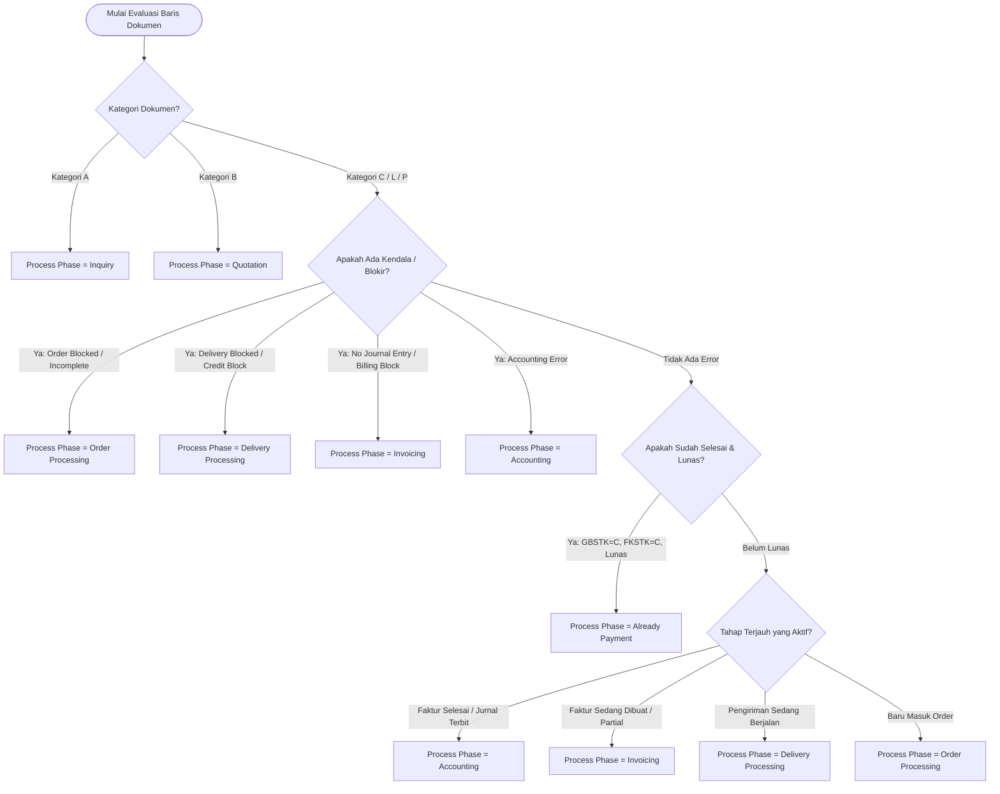

# Katalog Lengkap Kondisi Khusus & Skenario Bisnis Process Flow SAP SD (S/4HANA F2577)

Dokumen ini merupakan **referensi teknis dan fungsional komprehensif** mengenai seluruh kondisi khusus (*special business conditions*), variasi percabangan alur dokumen (*document flow branching*), serta logika pemetaan visual pada **SAP S/4HANA Process Flow (Fiori App F2577 - Track Sales Orders)**.

---

## 📑 Daftar Isi
1. [Prinsip Dasar Desain Process Flow SAP S/4HANA](#1-prinsip-dasar-desain-process-flow-sap-s4hana)
2. [Katalog Kondisi Khusus (Special Business Cases)](#2-katalog-kondisi-khusus-special-business-cases)
   - [Kasus A: Billing Blocked pada Debit Memo → Node `Planned Invoice`](#kasus-a-billing-blocked-pada-debit-memo--node-planned-invoice)
   - [Kasus B: Debit Memo dengan Kendala Jurnal → `No Journal Entry`](#kasus-b-debit-memo-dengan-kendala-jurnal--no-journal-entry)
   - [Kasus C: Debit Memo Selesai Faktur → Masuk Fase `Accounting`](#kasus-c-debit-memo-selesai-faktur--masuk-fase-accounting)
   - [Kasus D: Milestone & Down Payment Billing (Percabangan 3 Faktur)](#kasus-d-milestone--down-payment-billing-percabangan-3-faktur)
   - [Kasus E: Physical Sales Order Blocked / Incomplete](#kasus-e-physical-sales-order-blocked--incomplete)
   - [Kasus F: Rush Order Terblokir Limit Kredit (Credit Block)](#kasus-f-rush-order-terblokir-limit-kredit-credit-block)
   - [Kasus G: Barang Sedang Dalam Perjalanan (In Transit / POD Pending)](#kasus-g-barang-sedang-dalam-perjalanan-in-transit--pod-pending)
   - [Kasus H: Sampel Gratis Tertahan Persetujuan (Approval Pending)](#kasus-h-sampel-gratis-tertahan-persetujuan-approval-pending)
3. [Decision Tree: Aturan Penentuan Kolom `Process Phase`](#3-decision-tree-aturan-penentuan-kolom-process-phase)
4. [Matriks Visual UI5: State, Tipe Node, dan Donut Ring Header Lane](#4-matriks-visual-ui5-state-tipe-node-dan-donut-ring-header-lane)
5. [Tabel Perbandingan Kasus Nyata di Sistem](#5-tabel-perbandingan-kasus-nyata-di-sistem)

---

## 1. Prinsip Dasar Desain Process Flow SAP S/4HANA

Di SAP S/4HANA Fiori App **F2577 (Track Sales Orders)**:
1. **Bukan Rantai Statis**: Alur dokumen dibentuk secara dinamis berdasarkan data aktual di tabel relasi **`VBFA`** dan status pemenuhan di CDS View **`C_SlsDocFlfllmntAnalyzer`**.
2. **Dynamic Lanes (Lane Dinamis)**:
   - Header lane hanya muncul jika ada minimal 1 dokumen yang tergolong dalam kategori lane tersebut.
   - Transaksi non-fisik (misal: *Debit Memo*, *Service*, *Down Payment*) secara otomatis **tidak memunculkan lane Delivery**.
3. **Bottleneck Principle**:
   - Kolom **`Process Phase`** di List Report selalu menunjuk ke **fase di mana tindakan perbaikan (*action overdue / action required*) sedang tertahan**.

---

## 2. Katalog Kondisi Khusus (Special Business Cases)

```
┌──────────────────────────────────────────────────────────────────────────────────────────────────┐
│                                RINGKASAN VISUAL KASUS KHUSUS                                     │
├──────────────────────────────────────────────────────────────────────────────────────────────────┤
│                                                                                                  │
│ [Kasus A: Planned Node]     Debit Memo Request ───(putus-putus)───► Planned Invoice (Dashed)     │
│                             [Blocked for Invoicing]                 [Billing Planned For...]     │
│                                                                                                  │
│ [Kasus B: No Journal Entry] Debit Memo Request ───────────────────► Debit Memo                   │
│                             [Completed]                             [No Journal Entry - Merah]   │
│                                                                                                  │
│ [Kasus C: Fully Invoiced]   Debit Memo Request ───► Debit Memo ───► Journal Entry                │
│                             [Completed]             [Completed]     [Not Cleared / Open Item]    │
│                                                                                                  │
│ [Kasus D: Milestone Multi]                          ┌─► Down Payment Request ─► Journal Entry    │
│                             Sales Unit ─────────────┼─► Canceled Invoice     ─► Reversal Journal │
│                             [In Process]            └─► Active Final Invoice ─► Journal Entry    │
│                                                                                                  │
└──────────────────────────────────────────────────────────────────────────────────────────────────┘
```

---

### Kasus A: Billing Blocked pada Debit Memo → Node `Planned Invoice`
- **Contoh Dokumen**: `70000009`, `70000008`, `70000010`.
- **Tipe Dokumen**: `Debit Memo Request` (Kategori `DR` / `L` / `P`).
- **Kondisi Bisnis**:
  - Pelanggan mengajukan koreksi/tagihan debit tambahan.
  - Namun dokumen tersebut terkena pemblokiran faktur (*Billing Block Reason / FAKSP*, misal: *01 Check Credit* atau *02 Check Terms*).
  - Karena terblokir, faktur fisik belum terbentuk di `VBFA`, tetapi jadwal penagihan sudah direncanakan pada tanggal tertentu.
- **Karakteristik Visual di Process Flow**:
  - **Lane**: Hanya 1 lane **`Invoicing`** dengan ring merah sebagian (*Quarter/Half Red*).
  - **Node 1 (`Debit Memo Request`)**:
    * Status: **`Blocked for Invoicing`** (Silang Merah / `Negative`).
    * Teks Baris 1: `Requested Delivery On <Tanggal>`
    * Teks Baris 2: **`Not Invoiced`** *(menjelaskan bahwa faktur belum pernah terbit)*.
  - **Node 2 (`Planned Invoice` / Phantom Node)**:
    * Tipe Node: **`type: "Planned"`** *(bergaris tepi putus-putus / dashed border)*.
    * Status: `PlannedNeutral` (tanpa badge error).
    * Judul: **`Planned Invoice`**
    * Teks: **`Billing Planned For <Tanggal>`**
  - **Panah Penghubung**: **Garis panah putus-putus (*dashed connector line*)**.
- **Kolom `Process Phase` di List Report**: **`Order Processing`** (karena blokir terjadi pada dokumen permintaan awal).

---

### Kasus B: Debit Memo dengan Kendala Jurnal → `No Journal Entry`
- **Contoh Dokumen**: `70000013`.
- **Tipe Dokumen**: `Debit Memo Request` (`DR`) & `Debit Memo` (`M`).
- **Kondisi Bisnis**:
  - Permintaan nota debit sudah disetujui dan faktur *Debit Memo 90000030* sudah berhasil dibuat di SD.
  - Namun pada saat faktur hendak diposting ke Akuntansi Keuangan (*FI-AR*), terjadi kendala teknis/pemblokiran akun sehingga **jurnal akuntansi gagal terbentuk (*No Journal Entry / Posting Blocked in Invoice*)**.
  - Faktur ini harus di-*release* secara manual oleh tim Finance via transaksi SAP *VFX3*.
- **Karakteristik Visual di Process Flow**:
  - **Lane**: 1 lane **`Invoicing`** dengan **ring donat terbelah dua (setengah hijau, setengah merah)**.
  - **Node 1 (`Debit Memo Request 70000013`)**:
    * Status: **`Completed`** (Centang Hijau / `Positive`).
    * Teks: `Requested Delivery On <Tanggal>` & `Completely Invoiced`.
  - **Node 2 (`Debit Memo 90000030`)**:
    * Status: **`No Journal Entry`** (Silang Merah / `Negative`).
    * Teks: `Billed On <Tanggal>` & `Net Value <Jumlah> IDR`.
- **Kolom `Process Phase` di List Report**: **`Invoicing`** (karena titik macet berada di tahapan faktur/penagihan yang belum ter-post ke FI).

---

### Kasus C: Debit Memo Selesai Faktur → Masuk Fase `Accounting`
- **Contoh Dokumen**: `70000007`.
- **Tipe Dokumen**: `Debit Memo Request` (`DR`) → `Debit Memo` (`M`) → `Journal Entry` (`g`).
- **Kondisi Bisnis**:
  - Permintaan nota debit sudah selesai, faktur debit memo sudah terbit sukses, dan jurnal piutang **sudah berhasil terkirim ke modul FI**.
  - Dokumen sekarang berstatus *Open Item* di buku besar Finance, menunggu pencatatan pembayaran/penerimaan uang.
- **Karakteristik Visual di Process Flow**:
  - **Lane**: 2 lane (**`Invoicing`** → **`Accounting`**).
  - **Node 1 (`Debit Memo Request`)**: Status `Completed` (Hijau).
  - **Node 2 (`Debit Memo`)**: Status `Completed` (Hijau).
  - **Node 3 (`Journal Entry`)**: Status `Not Cleared` (Abu-abu / Open Item).
- **Kolom `Process Phase` di List Report**: **`Accounting`** (karena tahapan penagihan sudah selesai 100% dan bola proses ada di Akuntansi).

---

### Kasus D: Milestone & Down Payment Billing (Percabangan 3 Faktur)
- **Contoh Dokumen**: `2100000098`.
- **Tipe Dokumen**: `Sales Unit` (Non-Delivery / Billing Plan).
- **Kondisi Bisnis**:
  - Penjualan properti, konstruksi, atau jasa bernilai besar dengan penagihan bertahap (*Milestone Billing*).
  - Terdapat transaksi uang muka (*Down Payment Request / FAZ*), faktur termin yang sempat salah lalu dibatalkan (*Canceled Invoice via VF11*), dan faktur final pengganti yang sah.
- **Karakteristik Visual di Process Flow**:
  - **Lane**: **3 Lane** (`Order Processing` → `Invoicing` → `Accounting`).
  - **Node Induk (`Sales Unit 2100000098`)**: Status `In Process` (Abu-abu), memiliki 3 anak panah:
    * **Cabang 1**: `Down Payment Request` [Completed] ──► `Journal Entry` [Not Cleared]
    * **Cabang 2**: `Invoice` [Canceled] ──────────────► `Journal Entry` [Fully Cleared / Storno]
    * **Cabang 3**: `Invoice` [Completed] ─────────────► `Journal Entry` [Not Cleared]
- **Kolom `Process Phase` di List Report**: **`Invoicing`** atau **`Accounting`**.

---

### Kasus E: Physical Sales Order Blocked / Incomplete
- **Contoh Dokumen**: `2100000063`, `2100000182` (kasus 2024).
- **Tipe Dokumen**: `Sales Order` (Barang Fisik Normal).
- **Kondisi Bisnis**:
  - Pesanan barang fisik yang tertahan karena data belum lengkap (*Incompletion Log*) atau diblokir persetujuan manajerial.
  - Karena order terblokir, gudang tidak boleh menerbitkan Surat Jalan (*No Delivery Created*).
- **Karakteristik Visual di Process Flow**:
  - **Lane**: Hanya **1 Lane** (`Order Processing`).
  - **Node 1 (`Sales Unit / Sales Order`)**:
    * Status: **`Incomplete`** atau **`Blocked`** (Silang Merah / `Negative`).
    * Teks Baris 1: `Requested Delivery On <Tanggal>`
    * Teks Baris 2: **`Not Shipped`** *(menegaskan barang tidak dikirim)*.
- **Kolom `Process Phase` di List Report**: **`Order Processing`**.

---

### Kasus F: Rush Order Terblokir Limit Kredit (Credit Block)
- **Contoh Dokumen**: `10000003` (Dataset Standar SAP).
- **Kondisi Bisnis**:
  - Pesanan kilat (*Rush Order / RO*) di mana order berhasil dibuat, tetapi pada saat hendak dibuat Surat Jalan pengiriman, sistem mendeteksi piutang pelanggan melampaui batas kredit (*Credit Limit Exceeded - Delivery Block 01*).
- **Karakteristik Visual di Process Flow**:
  - **Lane**: 2 Lane (`Order Processing` [Hijau] → `Delivery Processing` [Silang Merah]).
- **Kolom `Process Phase` di List Report**: **`Delivery Processing`** (karena blokir terjadi pada saat pembuatan Surat Jalan).

---

### Kasus G: Barang Sedang Dalam Perjalanan (In Transit / POD Pending)
- **Contoh Dokumen**: `10000004` (Dataset Standar SAP).
- **Kondisi Bisnis**:
  - Barang sudah dipick dan dikemas oleh gudang, truk pengiriman sudah jalan (*Goods Issue Posted*), tetapi faktur tagihan belum dibuat karena sistem menunggu konfirmasi tanda terima fisik pelanggan (*Proof of Delivery / POD*).
- **Karakteristik Visual di Process Flow**:
  - **Lane**: 2 Lane (`Order Processing` [Hijau] → `Delivery Processing` [Abu-abu / In Transit]).
- **Kolom `Process Phase` di List Report**: **`Delivery Processing`**.

---

### Kasus H: Sampel Gratis Tertahan Persetujuan (Approval Pending)
- **Contoh Dokumen**: `10000005` (Dataset Standar SAP).
- **Kondisi Bisnis**:
  - Pesanan sampel gratis (*Delivery Free of Charge / FD*) senilai 0 EUR yang memerlukan persetujuan manajerial (*Workflow Approval Status B* dan *Billing Block 02 Check Prices & Terms*).
- **Karakteristik Visual di Process Flow**:
  - **Lane**: 1 Lane (`Order Processing`).
  - Node berstatus **`Warning / Pending Approval`** (Kuning).
- **Kolom `Process Phase` di List Report**: **`Order Processing`**.

---

## 3. Decision Tree: Aturan Penentuan Kolom `Process Phase`

Berikut adalah diagram alur keputusan (*Decision Tree*) yang mencerminkan logika standar SAP S/4HANA CDS View `C_SlsDocFlfllmntAnalyzer`:



---

## 4. Matriks Visual UI5: State, Tipe Node, dan Donut Ring Header Lane

| Skenario Node | Properti `type` UI5 | Properti `state` UI5 | Tampilan Kartu | Efek pada Header Lane Ring |
|---|---|---|---|---|
| **Normal Sukses** | `"Single"` | `"Positive"` | Garis solid, centang hijau | Menambah bobot warna **Hijau** |
| **Normal Bermasalah** | `"Single"` | `"Negative"` | Garis solid, silang merah | Menambah bobot warna **Merah** |
| **Normal Dalam Proses** | `"Single"` | `"Neutral"` | Garis solid, chevron abu-abu | Menambah bobot warna **Abu-abu** |
| **Peringatan / Pending** | `"Single"` | `"Critical"` | Garis solid, tanda seru kuning | Menambah bobot warna **Kuning** |
| **Kartu Rencana (*Planned*)** | **`"Planned"`** | **`"PlannedNeutral"`** | **Garis tepi putus-putus (*dashed border*)**, folded corner | *Tidak mempengaruhi warna ring* |

> [!TIP]
> **Logika Donut Ring Terbelah Dua (Split Donut Ring)**:
> Ketika dalam satu lane (misalnya lane *Invoicing*) terdapat **1 node Positive (Debit Memo Request)** dan **1 node Negative (Debit Memo No Journal Entry)**, UI5 `ProcessFlowLaneHeader` otomatis membagi lingkaran donat menjadi **50% Hijau dan 50% Merah** persis seperti tampilan standar SAP!

---

## 5. Tabel Perbandingan Kasus Nyata di Sistem

| Nomor Dokumen | Jenis Transaksi | Status Overall | Kolom Process Phase | Jumlah Lane | Ciri Khas Visual Process Flow |
|:---:|---|:---:|:---:|:---:|---|
| **`70000009`** | Debit Memo Request | **Silang Merah** *(Issue)* | **`Order Processing`** | **1 Lane** *(Invoicing)* | Kartu *Debit Memo Request Blocked* terhubung panah putus-putus ke **`Planned Invoice` (Dashed Border)** |
| **`70000013`** | Debit Memo Request | **Silang Merah** *(Issue)* | **`Invoicing`** | **1 Lane** *(Invoicing)* | Kartu *Completed* terhubung ke kartu **`Debit Memo (No Journal Entry)`**; Header lane memiliki **ring terbelah hijau-merah** |
| **`70000007`** | Debit Memo Request | **Centang Hijau** *(Completed)* | **`Accounting`** | **2 Lane** *(Invoicing → Accounting)* | Alur lengkap sukses dari Debit Memo Request → Debit Memo → Journal Entry |
| **`2100000098`** | Milestone Sales Unit | **Abu-abu** *(In Process)* | **`Invoicing`** | **3 Lane** *(Order → Invoicing → Accounting)* | 1 Sales Unit bercabang ke **3 Faktur** (Down Payment Request, Canceled Invoice, Active Invoice) |
| **`2100000063`** | Standard Sales Order | **Silang Merah** *(Blocked)* | **`Order Processing`** | **1 Lane** *(Order Processing)* | 1 Kartu *Sales Unit Incomplete* dengan teks *Not Shipped* |
| **`2110000182`** | Standard Tangible Goods | **Centang Hijau** *(Completed)* | **`Already Payment`** | **5 Lane** *(Lengkap)* | Rantai penuh dari Quotation → Sales Order → Delivery → Invoice → Cleared Journal |
