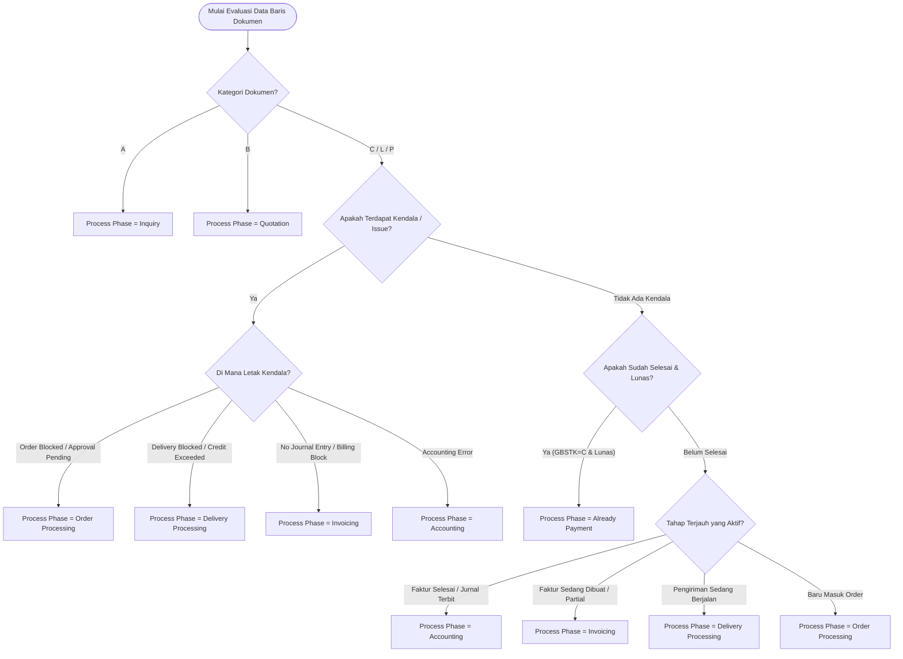

# SAP S/4HANA SD Process Flow: Master Katalog Kondisi Bisnis Standar (Fiori App F2577)

> **Dokumen Referensi Tunggal (*Single Source of Truth*)**  
> Merangkum seluruh kondisi bisnis khusus, logika pemetaan field CDS View (`C_SlsDocFlfllmntAnalyzer`), relasi tabel `VBFA`, serta visualisasi kartu dan header lane pada SAP S/4HANA Process Flow.

---

## 📌 Cheatsheet Cepat: Matriks 12 Kondisi Bisnis Standar SAP SD

| # | Kondisi Bisnis | Tipe Dokumen | Field Kunci SAP / CDS View | Status Node Kunci | Jumlah Lane | Bentuk Visual Khas | Kolom `Process Phase` |
|---|---|---|---|---|:---:|---|:---:|
| **1** | **Billing Blocked Debit Memo** | `DR` *(Debit Memo Req)* | `HeaderBillingBlockReason` != `""` | `Blocked for Invoicing` | **1 Lane** | Node 1 Silang Merah ──(putus-putus)──► Node 2 **`Planned Invoice` (Dashed Border)** | `Order Processing` |
| **2** | **No Journal Entry (Faktur Macet di SD)** | `DR` / `OR` | `FulfillmentStatusInInvoice` = `4` | `No Journal Entry` | **1 Lane** | Node 1 Hijau ──► Node 2 Silang Merah; Header Lane: **Split Donut Ring (Setengah Hijau, Setengah Merah)** | `Invoicing` |
| **3** | **Debit Memo Sukses Ter-Post ke FI** | `DR` *(Debit Memo Req)* | `FulfillmentStatusInInvoice` = `3` | `Completed` | **2 Lane** | `Debit Memo Request` [Hijau] ──► `Debit Memo` [Hijau] ──► `Journal Entry` [Open Item] | `Accounting` |
| **4** | **Milestone / Down Payment Billing** | `OR` *(Sales Unit)* | Billing Plan (Non-Delivery) | `In Process` | **3 Lane** | 1 Sales Unit bercabang ke **3 Faktur** (Down Payment Request, Canceled Invoice, Active Invoice) | `Invoicing` / `Accounting` |
| **5** | **Physical Order Blocked / Incomplete** | `OR` *(Standard Order)* | `DeliveryBlockReason` != `""` atau Incomplete | `Incomplete` / `Blocked` | **1 Lane** | 1 Kartu *Sales Unit Incomplete* dengan teks **`Not Shipped`** di lane *Order Processing* | `Order Processing` |
| **6** | **Rush Order Terblokir Limit Kredit** | `RO` *(Rush Order)* | `DeliveryBlockReason` = `'01'` | `Credit Limit Exceeded` | **2 Lane** | `Rush Order` [Hijau] ──► `Delivery Processing` [Silang Merah] | `Delivery Processing` |
| **7** | **Pengiriman Parsial (*Partial Delivery*)** | `OR` *(Standard Order)* | `OverallTotalDeliveryStatus` = `'B'` | `Partially Processed` | **5 Lane** | 1 Sales Order bercabang ke **Multiple Outbound Deliveries (Batch 1 & Batch 2)** | `Delivery Processing` |
| **8** | **Faktur Gabungan (*Collective Billing*)** | `OR` *(Standard Order)* | Multiple Deliveries to 1 Invoice | `Completed` | **5 Lane** | Banyak Surat Jalan mengarah ke **1 Faktur Rekapitulasi (*N-to-1*)** | `Invoicing` / `Accounting` |
| **9** | **Barang Dalam Perjalanan (*In Transit*)** | `OR` *(Standard Order)* | `FulfillmentStatusInTransit` = `'2'` | `In Transit` | **2 Lane** | Order [Hijau] ──► Delivery [Abu-abu / Sedang di Truk Ekspedisi]; Faktur belum dibuat (menunggu POD) | `Delivery Processing` |
| **10** | **Sampel Gratis Menunggu Persetujuan** | `FD` *(Free of Charge)* | `SalesDocApprovalStatus` = `'B'` | `Pending Approval` | **1 Lane** | 1 Kartu *Order Processing* berstatus **`Warning / Kuning`** dengan nilai 0.00 EUR | `Order Processing` |
| **11** | **Retur Barang & Nota Kredit** | `H` *(Returns Order)* | Document Category `'H'` & `'O'` | `Completed` | **4 Lane** | `Return Order` ──► `Return Delivery (GR)` ──► `Credit Memo` ──► `Accounting Reversal` | `Accounting` |
| **12** | **Pre-Sales Saja (*Inquiry & Quotation*)** | `A` & `B` | Document Category `'A'` & `'B'` | `Open Quotation` | **1 Lane** | `Inquiry` ──► `Quotation Part` (Alur berhenti di sini menunggu konfirmasi PO pelanggan) | `Quotation` |
| **13** | **Order dengan Rencana Kirim Tertahan (*Delivery Issue → Planned Delivery*)** | `OR` *(Sales Part)* | `OverallSDProcessStatus` = `'A'`, `DeliveryBlockReason` = `'01'` | `Delivery Issue` | **3 Lane** | `Quotation Part` [Hijau] ──► `Sales Part` [Silang Merah] ──(putus-putus)──► **`Planned Delivery` (Dashed Border)** | `Order Processing` |

---

## 🔍 Detail Penjelasan Setiap Kondisi Bisnis

```
┌──────────────────────────────────────────────────────────────────────────────────────────────────┐
│                               SKEMA VISUAL 6 POLA UTAMA PROCESS FLOW                             │
├──────────────────────────────────────────────────────────────────────────────────────────────────┤
│                                                                                                  │
│ [Pola 1: Planned Node]      Debit Memo Request ───(garis putus)───► Planned Invoice (Dashed)     │
│                                                                                                  │
│ [Pola 2: Split Donut Ring]  Debit Memo Request ───────────────────► Debit Memo (No Journal Entry)│
│                             (Lane Invoicing menampilkan icon ring 50% Hijau + 50% Merah)         │
│                                                                                                  │
│ [Pola 3: Multi-Branch]                              ┌─► Down Payment Request ─► Journal Entry    │
│                             Sales Unit ─────────────┼─► Canceled Invoice     ─► Reversal Journal │
│                                                     └─► Active Final Invoice ─► Journal Entry    │
│                                                                                                  │
│ [Pola 4: Incomplete Single] Sales Unit (Incomplete / Not Shipped)                                │
│                                                                                                  │
│ [Pola 5: Linear 5-Lane]     Quotation ──► Sales Order ──► Delivery ──► Invoice ──► Journal Entry │
│                                                                                                  │
│ [Pola 6: Collective N-to-1] Delivery 1 ──┐                                                       │
│                             Delivery 2 ──┴─► Collective Invoice ──► Journal Entry                │
│                                                                                                  │
└──────────────────────────────────────────────────────────────────────────────────────────────────┘
```

---

### 1. Kondisi: Billing Blocked pada Debit Memo Request → Node `Planned Invoice`
- **Konsep Standar SAP**: Dokumen permintaan nota debit memiliki rencana tanggal penagihan (*Billing Plan / Due Date*), tetapi faktur aslinya belum bisa dibentuk di tabel `VBFA` karena terkena blokir penagihan (*Billing Block Reason*, misal: *01 Check Credit Memo*, *02 Check Prices & Terms*).
- **Pemetaan Field SAP**:
  - `SalesDocumentType`: `'DR'`
  - `SDDocumentCategory`: `'L'`
  - `HeaderBillingBlockReason`: `'01'` atau `'02'`
  - `OverallSDProcessStatus`: `'A'` *(Not Yet Processed)*
- **Visualisasi Process Flow**:
  - **Lane**: Hanya 1 lane **`Invoicing`** dengan ring merah sebagian.
  - **Node 1**: `Debit Memo Request <Nomor>` (Status: `Blocked for Invoicing` - Silang Merah; Teks: `Requested Delivery On <Tgl>` & `Not Invoiced`).
  - **Node 2 (*Phantom Node*)**: `Planned Invoice` (Tipe: `Planned`, Garis tepi: **putus-putus / dashed border**; Teks: `Billing Planned For <Tgl>`).
  - **Konektor**: Garis panah putus-putus (*dashed line*).
- **Kolom `Process Phase`**: **`Order Processing`**.

---

### 2. Kondisi: Faktur Debit Memo Macet di SD (`No Journal Entry`)
- **Konsep Standar SAP**: Faktur *Debit Memo* sudah dibuat di modul SD, namun gagal membentuk jurnal akuntansi di modul FI (*FI-AR Posting Blocked*). Dokumen harus di-release manual via transaksi SAP *VFX3*.
- **Pemetaan Field SAP**:
  - `FulfillmentStatusInInvoice`: `'4'` *(Issue : Action Overdue)*
  - `FulfillmentStatusInAccounting`: `'1'` *(Not Yet Created)*
  - `BillingStatus`: `'C'` *(Completely Invoiced di level SD)*
- **Visualisasi Process Flow**:
  - **Lane**: 1 lane **`Invoicing`** dengan **Split Donut Ring (Setengah Hijau, Setengah Merah)**.
  - **Node 1**: `Debit Memo Request` (Status: `Completed` - Hijau).
  - **Node 2**: `Debit Memo` (Status: `No Journal Entry` - Silang Merah; Teks: `Billed On <Tgl>` & `Net Value <Jml> IDR`).
- **Kolom `Process Phase`**: **`Invoicing`** *(karena kendala macet di level penagihan/faktur)*.

---

### 3. Kondisi: Debit Memo Request Sukses Ter-Posting ke Akuntansi
- **Konsep Standar SAP**: Faktur debit memo sudah selesai dan jurnal akuntansi (*Journal Entry*) sudah terbentuk sukses. Dokumen berstatus *Open Item* di buku besar Finance, menunggu pelunasan piutang.
- **Pemetaan Field SAP**:
  - `FulfillmentStatusInInvoice`: `'3'` *(Completed)*
  - `FulfillmentStatusInAccounting`: `'2'` *(Partially Processed / Open Item)* atau `'3'` *(Cleared)*
- **Visualisasi Process Flow**:
  - **Lane**: 2 lane (**`Invoicing`** → **`Accounting`**).
  - **Node 1**: `Debit Memo Request` [Completed]
  - **Node 2**: `Debit Memo` [Completed]
  - **Node 3**: `Journal Entry` [Not Cleared / Cleared]
- **Kolom `Process Phase`**: **`Accounting`**.

---

### 4. Kondisi: Milestone & Down Payment Billing (Percabangan 3 Faktur)
- **Konsep Standar SAP**: Transaksi properti (*Sales Unit*), konstruksi, atau jasa bertahap tanpa pengiriman fisik (*Non-Delivery*). Terdapat uang muka (*Down Payment Request / FAZ*), faktur termin yang sempat salah lalu dibatalkan (*Canceled Invoice via VF11*), dan faktur pengganti yang aktif.
- **Pemetaan Field SAP**:
  - `DocumentTitle`: `'Sales Unit'`
  - Relasi `VBFA`: 1 Order VBELV memiliki 3 Invoice VBELN dengan status storno reversal.
- **Visualisasi Process Flow**:
  - **Lane**: **3 Lane** (`Order Processing` → `Invoicing` → `Accounting`).
  - **Node Induk (`Sales Unit`)**: Status `In Process`, bercabang ke:
    * **Cabang 1**: `Down Payment Request` [Completed] ──► `Journal Entry` [Not Cleared]
    * **Cabang 2**: `Invoice` [Canceled] ──────────────► `Journal Entry` [Fully Cleared / Storno]
    * **Cabang 3**: `Invoice` [Completed] ─────────────► `Journal Entry` [Not Cleared]
- **Kolom `Process Phase`**: **`Invoicing`** / **`Accounting`**.

---

### 5. Kondisi: Physical Sales Order Blocked / Incomplete
- **Konsep Standar SAP**: Order barang fisik biasa yang tertahan karena data pengiriman belum lengkap (*Incompletion Log*) atau diblokir limit kredit.
- **Pemetaan Field SAP**:
  - `OverallSDDocumentRejectionStatus`: `'C'` *(Issue)*
  - `DeliveryStatus`: `'A'` *(Not Delivered)*
- **Visualisasi Process Flow**:
  - **Lane**: **1 Lane** (`Order Processing`).
  - **Node 1**: `Sales Unit / Sales Order` (Status: `Incomplete` / `Blocked` - Silang Merah; Teks: `Requested Delivery On <Tgl>` & **`Not Shipped`**).
- **Kolom `Process Phase`**: **`Order Processing`**.

---

### 6. Kondisi: Rush Order Terblokir Limit Kredit (`Credit Limit Exceeded`)
- **Konsep Standar SAP**: Pesanan kilat (*Rush Order / RO*) di mana order berhasil dibuat, tetapi Surat Jalan (*Outbound Delivery*) diblokir karena limit kredit pelanggan terlampaui.
- **Pemetaan Field SAP**:
  - `SalesDocumentType`: `'RO'`
  - `DeliveryBlockReason`: `'01'` *(Credit Limit Exceeded)*
  - `FulfillmentStatusInSupply`: `'4'` *(Overdue Issue)*
- **Visualisasi Process Flow**:
  - **Lane**: 2 Lane (`Order Processing` [Hijau] → `Delivery Processing` [Silang Merah]).
- **Kolom `Process Phase`**: **`Delivery Processing`**.

---

### 7. Kondisi: Pengiriman Parsial (*Partial Deliveries*)
- **Konsep Standar SAP**: Stok barang dikirim dalam beberapa batch/tahap pengiriman terpisah.
- **Pemetaan Field SAP**:
  - `OverallTotalDeliveryStatus`: `'B'` *(Partially Delivered)*
- **Visualisasi Process Flow**:
  - **Lane**: 5 Lane lengkap. 1 Order bercabang ke 2 atau lebih Outbound Deliveries.
- **Kolom `Process Phase`**: **`Delivery Processing`**.

---

### 8. Kondisi: Faktur Gabungan (*Collective Billing / N-to-1*)
- **Konsep Standar SAP**: Beberapa Surat Jalan pengiriman digabungkan menjadi 1 faktur tagihan bersama di akhir periode.
- **Visualisasi Process Flow**:
  - Banyak node *Delivery* mengarah ke 1 node *Collective Invoice*.
- **Kolom `Process Phase`**: **`Invoicing`** / **`Accounting`**.

---

### 9. Kondisi: Barang Sedang Dalam Perjalanan (*In Transit / POD Pending*)
- **Konsep Standar SAP**: Truk ekspedisi sedang berjalan mengantar barang; faktur belum dibuat karena menunggu tanda terima (*Proof of Delivery*).
- **Pemetaan Field SAP**:
  - `FulfillmentStatusInDelivery`: `'3'` *(Picking/Packing Selesai)*
  - `FulfillmentStatusInTransit`: `'2'` *(In Transit)*
  - `FulfillmentStatusInInvoice`: `'1'` *(Not Yet Processed)*
- **Visualisasi Process Flow**:
  - Alur aktif di lane *Delivery Processing* (Abu-abu / In Transit).
- **Kolom `Process Phase`**: **`Delivery Processing`**.

---

### 10. Kondisi: Sampel Gratis Menunggu Persetujuan (*Approval Pending*)
- **Konsep Standar SAP**: Pesanan sampel gratis 0 EUR yang tertahan menunggu persetujuan (*Workflow Approval*).
- **Pemetaan Field SAP**:
  - `SalesDocumentType`: `'FD'` *(Free of Charge)*
  - `SalesDocApprovalStatus`: `'B'` *(Pending Approval)*
  - `HeaderBillingBlockReason`: `'02'` *(Check Prices & Terms)*
- **Visualisasi Process Flow**:
  - 1 Node di *Order Processing* dengan status **`Warning / Kuning`**.
- **Kolom `Process Phase`**: **`Order Processing`**.

---

## ⚙️ Diagram Logika Penentuan Kolom `Process Phase` (Decision Tree)



---

## 🎨 Spesifikasi Teknis SAPUI5 Process Flow

### 1. Nilai Enum `sap.suite.ui.commons.ProcessFlowNodeState`
- **`"Positive"`**: Centang Hijau (Sukses / Selesai).
- **`"Negative"`**: Silang Merah (Error / Blocked / Action Overdue).
- **`"Critical"`**: Tanda Seru Kuning (Warning / Approval Pending).
- **`"Neutral"`**: Chevron Abu-abu (In Process / Open Item).
- **`"PlannedNeutral"`**: Khusus untuk **Planned Node** (tidak memunculkan badge error).

### 2. Nilai Enum `sap.suite.ui.commons.ProcessFlowNodeType`
- **`"Single"`**: Kartu standar dengan garis tepi solid.
- **`"Planned"`**: Kartu semu/rencana dengan **garis tepi putus-putus (*dashed border*)** dan sudut terlipat (*folded corner*).
- **`"Aggregated"`**: Kartu grup untuk transaksi multi-dokumen.

### 3. Logika Perhitungan Donut Ring Header Lane (`ProcessFlowLaneHeader`)
Header lane menghitung proporsi status dari seluruh node yang berada di dalam lane tersebut:
$$\text{State Ratio} = \frac{\text{Jumlah Node Berstatus } X}{\text{Total Node di Lane}}$$
- **Contoh Kasus `70000013`**: Lane *Invoicing* memiliki 1 node *Positive* (Debit Memo Request) dan 1 node *Negative* (Debit Memo No Journal Entry).
- **Hasil Visual**: Header icon otomatis menampilkan **lingkaran donat terbelah dua (50% Hijau, 50% Merah)**.
