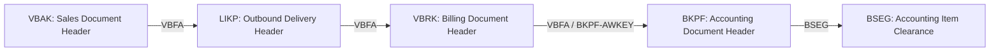

# 📘 SAP S/4HANA: ABAP RAP Backend Design (`ZUI_SD_DOCFLOW`)

Dokumen ini adalah arsitektur dan panduan implementasi backend **ABAP RESTful Application Programming Model (RAP)** untuk layanan **`ZUI_SD_DOCFLOW`** (OData V4) yang menggabungkan seluruh kebutuhan **Header Tracking** dan **Visual Process Flow Diagram** dalam satu Service Binding terpadu.

---

## 💡 1. Analisis: Mengapa Menggunakan Custom RAP `ZUI_SD_DOCFLOW`?

### **Rekomendasi: ARSITEKTUR TERPADU (Single Unified RAP Service)**

| Aspek | Jika Hanya Mengandalkan Standard `SD_SOFA` (V2) | Dengan Custom RAP `ZUI_SD_DOCFLOW` (V4) ⭐ |
| :--- | :--- | :--- |
| **Pohon Dokumen Alur (`VBFA`)** | ❌ Standard tidak memiliki entity siap saji untuk node `ProcessFlow` dengan relasi `SubsequentDocs`. | ✅ **Disediakan langsung oleh Custom Entity `DocRelations`**, siap dirender ke diagram visual. |
| **Protokol Layanan** | ⚠️ OData V2 legacy (overhead XML/JSON metadata lebih besar). | ✅ **OData V4 modern**, payload lebih ringan, performa lebih cepat. |
| **Keterpaduan Endpoint** | ⚠️ Butuh 2 service terpisah (V2 untuk Header + V4 untuk Flow). | ✅ **1 Single Unified Service (`ZUI_SD_DOCFLOW`)** berisi `DocHeader` dan `DocRelations`. |
| **Fleksibilitas Kustomisasi** | ❌ Bergantung pada CDS view standar yang kaku. | ✅ Bebas menambahkan field khusus perusahaan (misal: Custom Status, Plant, Approval Flow). |

> ℹ️ **Status implementasi saat ini**: potensi "Single Unified Service" **baru dimanfaatkan setengahnya**. Aplikasi memakai `ZUI_SD_DOCFLOW` hanya untuk `DocRelations`, sementara header tetap dari `SD_SOFA` (V2). Migrasi header ke `DocHeader` memerlukan perbaikan logika status di `ZI_SD_DocHeader` terlebih dahulu — lihat [AUDIT_DAN_REKOMENDASI_KODE_BACKEND_RAP.md](file:///AUDIT_DAN_REKOMENDASI_KODE_BACKEND_RAP.md) bagian 5.1.

---

## 🏛️ 2. Arsitektur Relasi Database (DB Schema)



---

## 🏗️ 3. Definisi CDS Views Layer

Layanan `ZUI_SD_DOCFLOW` mengekspos 2 Entity:
1. **`ZC_SD_DocHeader`**: Grid Header Dokumen Penjualan (View Entity).
2. **`ZR_SD_DocRelation`**: Node dan Relasi Alur Dokumen untuk Diagram (Custom Entity berbasis ABAP Query).

> ⚠️ **Status pemakaian oleh aplikasi**: SAPUI5 saat ini **hanya memanggil `DocRelations`**. Daftar header tabel masih ditarik dari OData V2 standar `C_SlsDocFlfllmntAnalyzer` (service `SD_SOFA`), sehingga entity `DocHeader` **diekspos tetapi belum dikonsumsi**. Lihat [DUAL_BACKEND_ARCHITECTURE_EXPLANATION.md](file:///DUAL_BACKEND_ARCHITECTURE_EXPLANATION.md).

---

### Step 3.1: Interface View Header (`ZI_SD_DocHeader`)
```abap
@AccessControl.authorizationCheck: #NOT_REQUIRED
@EndUserText.label: 'SD Document Header Interface View'
define root view entity ZI_SD_DocHeader 
  as select from vbak
{
  key vbeln                                     as SalesDocument,
      erdat                                     as CreationDate,
      ernam                                     as CreatedByUser,
      audat                                     as SalesDocumentDate,
      vbtyp                                     as SDDocumentCategory,
      vdatu                                     as RequestedDeliveryDate,
      abstk                                     as OverallSDRejectionStatus,
      lfstk                                     as OverallTotalDeliveryStatus,
      gbstk                                     as OverallSDProcessStatus,
      vkorg                                     as SalesOrganization,
      vtweg                                     as DistributionChannel,
      spart                                     as OrganizationDivision,
      waerk                                     as TransactionCurrency,
      
      @Semantics.amount.currencyCode: 'TransactionCurrency'
      netwr                                     as TotalNetAmount,
      
      // Standard SAP S/4HANA F2577 Overall Fulfillment Status (1=Open, 2=InProcess, 3=Completed, 4=Overdue, 5=DueNext)
      case 
        when abstk = 'C' then '4'
        when gbstk = 'C' then '3'
        when gbstk = 'B' or lfstk = 'B' or lfstk = 'C' or abstk = 'B' then '2'
        else '1'
      end                                       as OverallFulfillmentStatus,

      // Standard SAP S/4HANA Process Phase (1=In Order, 2=In Supply/Delivery, 3=Completed/Accounting)
      case 
        when gbstk = 'C' then '3'
        when gbstk = 'B' and ( lfstk = 'C' or lfstk = 'B' ) then '3'
        when lfstk = 'B' or lfstk = 'C' or vbtyp = 'J' then '2'
        when vbtyp = 'A' or vbtyp = 'B' or vbtyp = 'C' then '1'
        else '1'
      end                                       as FulfillmentProcessPhase,
      
      // Stage Fulfillment Statuses for 6 Columns
      case when gbstk is not initial then '3' else '1' end as FulfillmentStatusInOrder,
      case when lfstk = 'C' then '3' when lfstk = 'B' then '2' else '1' end as FulfillmentStatusInDelivery,
      case when gbstk = 'C' then '3' when gbstk = 'B' then '2' else '1' end as FulfillmentStatusInAccounting
}
```

---

### Step 3.2: Custom Entity Relasi Node Diagram (`ZR_SD_DocRelation`)

> 🔴 **VERSI DI BAWAH INI SUDAH DIGANTI.** Definisi aktif (siap deploy) ada di
> [`abap/ZR_SD_DocRelation.ddls.abap`](file:///abap/ZR_SD_DocRelation.ddls.abap).
> Perubahan utama: `DocNumber` menjadi `abap.char(30)` (menampung key phantom `PLDEL_*`/`PLINV_*`/`PLJE_*`),
> plus field baru `PrecedingDocs`, `LaneKey`, `SortOrder`, `RequestedDelivDate`, `GoodsIssueDate`,
> `BillingDate`, `PostingDate`, `ReferenceDoc`. Nilai `Status` kini memakai nama state UI5 langsung
> (`Positive`/`Critical`/`Negative`/`Neutral`/`Planned`/`PlannedNegative`).

```abap
@EndUserText.label: 'Document Flow Nodes Relations (Custom Query)'
@ObjectModel.query.implementedBy: 'ABAP:ZCL_SD_DOCFLOW_QUERY'
define root custom entity ZR_SD_DocRelation
{
  key AnchorSalesDocument : vbeln;              // Nomor dokumen yang diklik (Anchor)
  key DocNumber           : vbeln;              // Nomor dokumen node diagram
      DocCategory         : vbtyp;              // Kategori Dokumen (A, B, C, J, M, g)
      DocTitle            : val_text;           // Judul Node (e.g. "Sales Order", "Outbound Delivery")
      Status              : abap.char(10);      // State UI5: "Positive", "Warning", "Error", "Neutral", "Planned"
      StatusText          : val_text;           // Keterangan: "Completed", "In Process", "Shipped"
      CreatedOnDate       : erdat;              // Tanggal pembuatan
      CreatedBy           : ernam;              // Dibuat oleh
      SubsequentDocs      : abap.string;        // Daftar node turunan (e.g., "node_80000192,node_90000142")
      ExtraLine1          : abap.string;        // Baris teks tambahan ke-1 pada kartu node
      ExtraLine2          : abap.string;        // Baris teks tambahan ke-2 pada kartu node
      NodeType            : abap.char(10);      // Tipe node UI5: "Single", "Planned", dsb.
      AdditionalInfo      : abap.string;        // Info tambahan untuk popover detail node
      Currency            : waers;
      
      @Semantics.amount.currencyCode: 'Currency'
      NetValue            : abap.curr( 15, 2 );
}
```

> ⚠️ **Nama field `type` di frontend**: `_transformAndBindProcessFlow` membaca `item.type` untuk menentukan `ProcessFlowNode.type`. Karena `type` adalah kata yang lazim bertabrakan, sediakan alias di *consumption projection* (`NodeType as type`) atau sesuaikan controller ke `NodeType`.

---

### Step 3.2.1: Kontrak Data Frontend ↔ Backend (WAJIB Dipatuhi)

Tabel berikut adalah kontrak nyata yang dibaca `_transformAndBindProcessFlow` (`Main.controller.js` L4747–4902). Field di luar tabel ini akan diabaikan frontend.

| Field Entity | Dipakai Frontend Untuk | Wajib? | Perilaku Bila Kosong |
| :--- | :--- | :--: | :--- |
| `AnchorSalesDocument` | Kunci filter `$filter=AnchorSalesDocument eq '<doc>'` | ✅ | Query mengembalikan 0 baris |
| `DocNumber` | `nodeId = "node_" + DocNumber`, dan bagian judul node | ✅ | Node tidak dapat dibentuk |
| `DocCategory` | Penentuan lane & singkatan node | ✅ | Node jatuh ke lane default `lane_order`, singkatan `DOC` |
| `DocTitle` | Judul node (`DocTitle + " " + DocNumber`) | ✅ | Judul node hanya berisi nomor |
| `Status` | Dipetakan ke state UI5 node | ✅ | Default `Positive` |
| `StatusText` | `ProcessFlowNode.stateText` | ⬜ | Teks state kosong |
| `CreatedOnDate` | Baris teks fallback `"Created On <tanggal>"` | ⬜ | Baris teks kosong |
| `CreatedBy` | Detail di `DocDetailsPopover` | ⬜ | Kolom detail kosong |
| `SubsequentDocs` | `children = SubsequentDocs.split(",")` | ✅ | Node menjadi ujung alur (tanpa garis keluar) |
| `ExtraLine1`, `ExtraLine2` | Dua baris teks pada kartu node | ⬜ | Frontend memakai fallback `["Created On " + CreatedOnDate]` |
| `type` / `NodeType` | `ProcessFlowNode.type` | ⬜ | Default `"Single"` |
| `AdditionalInfo` | Detail di `DocDetailsPopover` | ⬜ | Kolom detail kosong |
| `NetValue`, `Currency` | **Tidak dirender** di node maupun popover saat ini | ⬜ | Tidak berpengaruh |

#### 🔗 Kontrak Kritis: Prefiks `node_` pada `SubsequentDocs`

Frontend membentuk `nodeId` sebagai `"node_" + DocNumber`, lalu memakai hasil `SubsequentDocs.split(",")` **secara langsung** sebagai array `children`. Karena itu:

```
✅ BENAR : SubsequentDocs = 'node_80000192,node_90000142'
❌ SALAH : SubsequentDocs = '80000192,90000142'        -> garis relasi tidak tergambar
❌ SALAH : SubsequentDocs = 'node_80000192, node_90000142'  -> spasi ikut terbaca, node tidak ketemu
```

Implementasi ABAP di bagian 4 sudah memenuhi kontrak ini (`APPEND |node_{ ls_ch-vbeln }| TO lt_children.` lalu `concat_lines_of( table = lt_children sep = ',' )` — tanpa spasi).

#### 🎨 Pemetaan `Status` → State UI5

| Nilai `Status` dari Backend | State `ProcessFlowNode` di UI5 | Warna Kartu |
| :--- | :--- | :--- |
| `Positive` | `Positive` | Hijau |
| `Warning` | **`Critical`** | Kuning |
| `Error` | **`Negative`** | Merah |
| `Planned` | **`PlannedNeutral`** | Abu-abu garis putus-putus |
| `Neutral` | `Neutral` | Abu-abu |
| *(lainnya / kosong)* | `Positive` | Hijau |

#### 🛣️ Pemetaan `DocCategory` → Lane

Frontend mendefinisikan **5 lane**. Kategori yang tidak terdaftar jatuh ke `lane_order`.

| `DocCategory` | `laneId` | Teks Lane | Singkatan Node |
| :--: | :--- | :--- | :--: |
| `B` | `lane_quotation` | Quotation Processing | `QT` |
| `C` | `lane_order` | Order Processing | `SO` |
| `J` | `lane_delivery` | Delivery Processing | `OD` |
| `R`, `h` | `lane_delivery` | Delivery Processing | `GI` |
| `M` | `lane_invoicing` | Invoicing | `INV` |
| `g`, `r` | `lane_accounting` | Accounting | `JE` |
| lainnya (termasuk `A`) | `lane_order` | Order Processing | `DOC` |

> ⚠️ **Tidak ada lane Inquiry.** Kategori `A` (Inquiry) saat ini dirender di lane *Order Processing*. Jika lane Inquiry diperlukan, ubah `_transformAndBindProcessFlow` di frontend — bukan backend.


---

### Step 3.3: Consumption Projection (`ZC_SD_DocHeader`)
```abap
@AccessControl.authorizationCheck: #NOT_REQUIRED
@EndUserText.label: 'SD Document Header Projection View'
@Metadata.allowExtensions: true
define root view entity ZC_SD_DocHeader
  as projection on ZI_SD_DocHeader
{
  key SalesDocument,
      CreationDate,
      CreatedByUser,
      SalesDocumentDate,
      SDDocumentCategory,
      RequestedDeliveryDate,
      OverallSDRejectionStatus,
      OverallTotalDeliveryStatus,
      OverallSDProcessStatus,
      SalesOrganization,
      DistributionChannel,
      OrganizationDivision,
      TransactionCurrency,
      
      @Semantics.amount.currencyCode: 'TransactionCurrency'
      TotalNetAmount,
      
      OverallFulfillmentStatus,
      FulfillmentProcessPhase,
      FulfillmentStatusInOrder,
      FulfillmentStatusInDelivery,
      FulfillmentStatusInAccounting
}
```

---

## ⚙️ 4. Implementasi Query Provider ABAP (`ZCL_SD_DOCFLOW_QUERY`)

> 🔴 **KODE DI BAWAH INI SUDAH DIGANTI (jangan dipakai lagi).** Implementasi aktif dan siap deploy:
> [`abap/ZCL_SD_DOCFLOW_QUERY.clas.abap`](file:///abap/ZCL_SD_DOCFLOW_QUERY.clas.abap).
>
> Perbedaan pokok versi baru:
> * Penelusuran `VBFA` **iteratif dua arah** (bukan 3 level hardcode) dengan batas kedalaman & jumlah node.
> * Status **dinamis**: `VBAK-ABSTK/LIFSK/FAKSK/GBSTK/LFSTK/FKSAK`, `LIKP-WBSTK/KOSTK/LIFSK/TRSTA`,
>   `VBRK-RFBSK/FKSTO/SFAKN`, `BKPF-STBLG`, `BSEG-AUGBL` (tanpa `VBRK-FKSTK`).
> * `ExtraLine1`/`ExtraLine2` kontekstual per lane (Requested Delivery On / Shipped On / Net Value / Posted On).
> * Node phantom `Planned Delivery`, `Planned Invoice`, `Planned Journal Entry` + `PrecedingDocs`.
> * Journal Entry diambil dari `BKPF-AWKEY` (bukan mengandalkan entri `VBFA`).
> * Semua variabel dideklarasikan eksplisit di awal method (bebas error *variable already declared*).


Class ini bertugas mengekstrak rantai relasi alur dokumen dari tabel `VBFA`, `VBAK`, `LIKP`, `VBRK`, dan `BKPF` secara otomatis dengan dukungan konversi format SAP (`ALPHA`) serta pencarian dua arah (Preceding & Subsequent):

```abap
CLASS zcl_sd_docflow_query DEFINITION
  PUBLIC
  FINAL
  CREATE PUBLIC .

  PUBLIC SECTION.
    INTERFACES if_rap_query_provider .
  PROTECTED SECTION.
  PRIVATE SECTION.
ENDCLASS.

CLASS zcl_sd_docflow_query IMPLEMENTATION.

  METHOD if_rap_query_provider~select.
    DATA: lt_result   TYPE TABLE OF zr_sd_docrelation,
          ls_result   LIKE LINE OF lt_result,
          lv_anchor   TYPE vbeln.

    TRY.
        " -------------------------------------------------------------
        " 1. Tangani Paging & Request Checks (MANDATORY di RAP OData V4)
        " -------------------------------------------------------------
        DATA: lv_top  TYPE int8,
              lv_skip TYPE int8.

        IF io_request->is_data_requested( ).
          DATA(lo_paging) = io_request->get_paging( ).
          IF lo_paging IS BOUND.
            lv_top  = lo_paging->get_page_size( ).
            lv_skip = lo_paging->get_offset( ).
          ENDIF.
        ENDIF.

        " -------------------------------------------------------------
        " 2. Ambil filter AnchorSalesDocument dari request UI5
        " -------------------------------------------------------------
        IF io_request->get_filter( ) IS BOUND.
          DATA(lt_filter_cond) = io_request->get_filter( )->get_as_ranges( ).
          LOOP AT lt_filter_cond INTO DATA(ls_filter) 
            WHERE name = 'ANCHORSALESDOCUMENT' OR name = 'AnchorSalesDocument'.
            READ TABLE ls_filter-range INTO DATA(ls_range) INDEX 1.
            IF sy-subrc = 0.
              lv_anchor = ls_range-low.
            ENDIF.
          ENDLOOP.
        ENDIF.

        IF lv_anchor IS INITIAL.
          IF io_request->is_total_numb_of_rec_requested( ).
            io_response->set_total_number_of_records( 0 ).
          ENDIF.
          IF io_request->is_data_requested( ).
            io_response->set_data( lt_result ).
          ENDIF.
          RETURN.
        ENDIF.

        " Pastikan format internal SAP dengan Leading Zeros (ALPHA Conversion)
        lv_anchor = |{ lv_anchor ALPHA = IN }|.

        " -------------------------------------------------------------
        " 3. Kumpulkan dokumen rantai alur dari DB (VBAK, LIKP, VBRK, VBFA)
        " -------------------------------------------------------------
        TYPES: BEGIN OF ty_doc,
                 vbeln TYPE vbeln,
                 vbtyp TYPE vbtyp,
               END OF ty_doc.
        DATA: lt_flow_docs TYPE HASHED TABLE OF ty_doc WITH UNIQUE KEY vbeln.

        " Identifikasi Dokumen Anchor
        SELECT SINGLE vbeln, vbtyp FROM vbak WHERE vbeln = @lv_anchor INTO @DATA(ls_anchor_doc).
        IF sy-subrc = 0.
          INSERT VALUE #( vbeln = ls_anchor_doc-vbeln vbtyp = ls_anchor_doc-vbtyp ) INTO TABLE lt_flow_docs.
        ELSE.
          SELECT SINGLE vbeln, vbtyp FROM likp WHERE vbeln = @lv_anchor INTO @DATA(ls_del_doc).
          IF sy-subrc = 0.
            INSERT VALUE #( vbeln = ls_del_doc-vbeln vbtyp = 'J' ) INTO TABLE lt_flow_docs.
          ELSE.
            SELECT SINGLE vbeln, vbtyp FROM vbrk WHERE vbeln = @lv_anchor INTO @DATA(ls_bil_doc).
            IF sy-subrc = 0.
              INSERT VALUE #( vbeln = ls_bil_doc-vbeln vbtyp = 'M' ) INTO TABLE lt_flow_docs.
            ENDIF.
          ENDIF.
        ENDIF.

        " Cari Preceding Documents (Order -> Quotation -> Inquiry)
        SELECT vbelv, vbtyp_v FROM vbfa WHERE vbeln = @lv_anchor INTO TABLE @DATA(lt_prec).
        LOOP AT lt_prec INTO DATA(ls_p).
          INSERT VALUE #( vbeln = ls_p-vbelv vbtyp = ls_p-vbtyp_v ) INTO TABLE lt_flow_docs.
        ENDLOOP.

        IF lt_prec IS NOT INITIAL.
          SELECT vbelv, vbtyp_v FROM vbfa FOR ALL ENTRIES IN @lt_prec WHERE vbeln = @lt_prec-vbelv INTO TABLE @DATA(lt_prec2).
          LOOP AT lt_prec2 INTO DATA(ls_p2).
            INSERT VALUE #( vbeln = ls_p2-vbelv vbtyp = ls_p2-vbtyp_v ) INTO TABLE lt_flow_docs.
          ENDLOOP.
        ENDIF.

        " Cari Subsequent Documents Level 1 (Delivery)
        SELECT vbeln, vbtyp_n FROM vbfa WHERE vbelv = @lv_anchor INTO TABLE @DATA(lt_sub1).
        LOOP AT lt_sub1 INTO DATA(ls_s1).
          INSERT VALUE #( vbeln = ls_s1-vbeln vbtyp = ls_s1-vbtyp_n ) INTO TABLE lt_flow_docs.
        ENDLOOP.

        " Cari Subsequent Documents Level 2 (Goods Issue / Billing)
        IF lt_sub1 IS NOT INITIAL.
          SELECT vbeln, vbtyp_n FROM vbfa FOR ALL ENTRIES IN @lt_sub1 WHERE vbelv = @lt_sub1-vbeln INTO TABLE @DATA(lt_sub2).
          LOOP AT lt_sub2 INTO DATA(ls_s2).
            INSERT VALUE #( vbeln = ls_s2-vbeln vbtyp = ls_s2-vbtyp_n ) INTO TABLE lt_flow_docs.
          ENDLOOP.
        ENDIF.

        " Cari Subsequent Documents Level 3 (Accounting Journal Entry)
        IF lt_sub2 IS NOT INITIAL.
          SELECT vbeln, vbtyp_n FROM vbfa FOR ALL ENTRIES IN @lt_sub2 WHERE vbelv = @lt_sub2-vbeln INTO TABLE @DATA(lt_sub3).
          LOOP AT lt_sub3 INTO DATA(ls_s3).
            INSERT VALUE #( vbeln = ls_s3-vbeln vbtyp = ls_s3-vbtyp_n ) INTO TABLE lt_flow_docs.
          ENDLOOP.
        ENDIF.

        " -------------------------------------------------------------
        " 4. Bangun atribut Node untuk setiap dokumen alur
        " -------------------------------------------------------------
        LOOP AT lt_flow_docs INTO DATA(ls_doc).
          CLEAR ls_result.
          ls_result-AnchorSalesDocument = lv_anchor.
          ls_result-DocNumber           = ls_doc-vbeln.
          ls_result-DocCategory         = ls_doc-vbtyp.

          CASE ls_doc-vbtyp.
            WHEN 'A' OR 'B' OR 'C'.
              SELECT SINGLE erdat, ernam, netwr, waerk FROM vbak WHERE vbeln = @ls_doc-vbeln INTO @DATA(ls_vbak).
              ls_result-CreatedOnDate = ls_vbak-erdat.
              ls_result-CreatedBy     = ls_vbak-ernam.
              ls_result-NetValue      = ls_vbak-netwr.
              ls_result-Currency      = ls_vbak-waerk.
              ls_result-Status        = 'Positive'.
              IF ls_doc-vbtyp = 'A'.
                ls_result-DocTitle   = 'Inquiry'.
                ls_result-StatusText = 'Completed'.
              ELSEIF ls_doc-vbtyp = 'B'.
                ls_result-DocTitle   = 'Quotation'.
                ls_result-StatusText = 'Fully Referenced'.
              ELSE.
                ls_result-DocTitle   = 'Sales Order'.
                ls_result-StatusText = 'Complete'.
              ENDIF.

            WHEN 'J'.
              SELECT SINGLE erdat, ernam FROM likp WHERE vbeln = @ls_doc-vbeln INTO @DATA(ls_likp).
              ls_result-CreatedOnDate = ls_likp-erdat.
              ls_result-CreatedBy     = ls_likp-ernam.
              ls_result-DocTitle      = 'Outbound Delivery'.
              ls_result-StatusText    = 'Shipped'.
              ls_result-Status        = 'Positive'.

            WHEN 'R' OR 'h'.
              ls_result-DocTitle      = 'Goods Issue'.
              ls_result-StatusText    = 'Completed'.
              ls_result-Status        = 'Positive'.

            WHEN 'M'.
              SELECT SINGLE fkdat, ernam, netwr, waerk, rfbsk FROM vbrk WHERE vbeln = @ls_doc-vbeln INTO @DATA(ls_vbrk).
              ls_result-CreatedOnDate = ls_vbrk-fkdat.
              ls_result-CreatedBy     = ls_vbrk-ernam.
              ls_result-NetValue      = ls_vbrk-netwr.
              ls_result-Currency      = ls_vbrk-waerk.
              ls_result-DocTitle      = 'Invoice / Billing'.
              ls_result-StatusText    = 'Cleared'.
              ls_result-Status        = 'Positive'.

            WHEN 'g' OR 'r'.
              SELECT SINGLE bukrs, belnr, budat, usnam FROM bkpf 
                WHERE belnr = @ls_doc-vbeln OR awkey = @ls_doc-vbeln 
                INTO @DATA(ls_bkpf).
              ls_result-CreatedOnDate = ls_bkpf-budat.
              ls_result-CreatedBy     = ls_bkpf-usnam.
              ls_result-DocTitle      = 'Accounting Document'.
              ls_result-StatusText    = 'Cleared'.
              ls_result-Status        = 'Positive'.
          ENDCASE.

          " -------------------------------------------------------------
          " 5. Buat relasi garis penghubung (Children / SubsequentDocs)
          " -------------------------------------------------------------
          DATA(lt_children) = VALUE string_t( ).
          SELECT vbeln FROM vbfa WHERE vbelv = @ls_doc-vbeln INTO TABLE @DATA(lt_ch).
          LOOP AT lt_ch INTO DATA(ls_ch).
            IF line_exists( lt_flow_docs[ vbeln = ls_ch-vbeln ] ).
              APPEND |node_{ ls_ch-vbeln }| TO lt_children.
            ENDIF.
          ENDLOOP.

          ls_result-SubsequentDocs = concat_lines_of( table = lt_children sep = ',' ).
          APPEND ls_result TO lt_result.
        ENDLOOP.

        " -------------------------------------------------------------
        " 6. Response Handling Sesuai Kontrak RAP OData V4
        " -------------------------------------------------------------
        IF io_request->is_total_numb_of_rec_requested( ).
          io_response->set_total_number_of_records( lines( lt_result ) ).
        ENDIF.

        IF io_request->is_data_requested( ).
          io_response->set_data( lt_result ).
        ENDIF.

      CATCH cx_rap_query_provider cx_rap_query_filter_no_range.
        " Exception handling
    ENDTRY.
  ENDMETHOD.
ENDCLASS.
```

---

## 🚀 5. Service Definition & Service Binding (`ZSD_SD_DOCFLOW` & `ZUI_SD_DOCFLOW`)

### 1. Service Definition (`ZSD_SD_DOCFLOW`)
```abap
@EndUserText.label: 'Service Definition Track SD Document Flow'
define service ZSD_SD_DOCFLOW {
  expose ZC_SD_DocHeader   as DocHeader;
  expose ZR_SD_DocRelation as DocRelations;
}
```

### 2. Service Binding (`ZUI_SD_DOCFLOW`)
1. **Binding Name**: **`ZUI_SD_DOCFLOW`**
2. **Binding Type**: **`OData V4 - UI`**
3. **Service Definition**: `ZSD_SD_DOCFLOW`
4. **Publish Service**: Tekan tombol **Publish** di ABAP Development Tools (ADT Eclipse).
5. **Endpoint URL yang Dihasilkan**:
   ```
   /sap/opu/odata4/sap/zui_sd_docflow/srvd/sap/zsd_sd_docflow/0001/
   ```

> [!TIP]
> URL di atas sudah 100% cocok dan identik dengan konfigurasi `dataSource: rapService` di file `webapp/manifest.json`.

---

## 🎯 6. Kesimpulan & Manfaat Arsitektur Ini

Dengan menerapkan backend **`ZUI_SD_DOCFLOW`**:
1. **Frontend SAPUI5 Terhubung Sempurna**: Sinkronisasi nama objek backend dan `manifest.json` memastikan tidak ada kesalahan pemanggilan (*404 Not Found*).
2. **Visual Flow Akurat**: Diagram `ProcessFlow` terisi data aktual dari tabel relasi `VBFA` sistem SAP Anda.
3. **Pencarian Dokumen Tangguh**: Adanya konversi `ALPHA` menjamin nomor dokumen dengan atau tanpa *leading zeros* tetap terbaca sempurna di database SAP.
4. **Performa Tinggi**: Menggunakan standar CDS View Entities S/4HANA 2025 yang dioptimasi untuk database SAP HANA.

### Prasyarat agar Manfaat di Atas Benar-Benar Tercapai

| Prasyarat | Status Saat Ini |
| :--- | :--- |
| Response `/DocRelations` tiba **< 600 ms** | ⚠️ Belum diverifikasi. Frontend memasang timer fallback 600 ms (`Main.controller.js` L4151–4154); jika terlampaui, diagram dirender dari data lokal/sintetis. |
| `SubsequentDocs` berprefiks `node_` tanpa spasi | ✅ Sudah dipenuhi kode di bagian 4. |
| Field `ExtraLine1` / `ExtraLine2` / `type` tersedia | ❌ Belum ada di definisi entity versi ini (lihat bagian 3.2 & 3.2.1). Frontend akan memakai nilai default. |
| Status node dinamis (bukan hardcode) | ❌ Bagian 4 masih men-*hardcode* `'Positive'` / `'Shipped'` / `'Cleared'`. Perbaikan tersedia di [AUDIT_DAN_REKOMENDASI_KODE_BACKEND_RAP.md](file:///AUDIT_DAN_REKOMENDASI_KODE_BACKEND_RAP.md) bagian 5.2. |
| Entity `DocHeader` dikonsumsi frontend | ❌ Belum. Header masih dari OData V2 `C_SlsDocFlfllmntAnalyzer`. |

